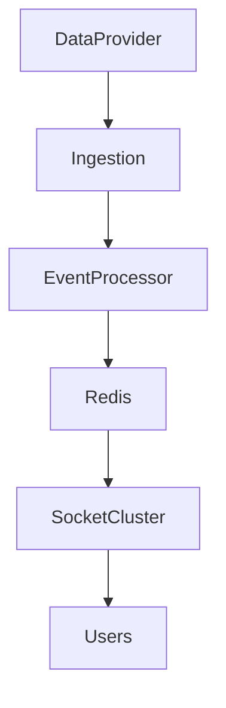
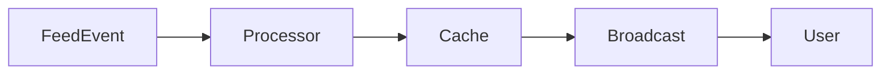
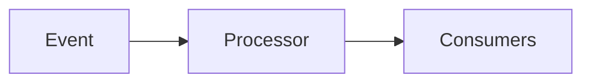
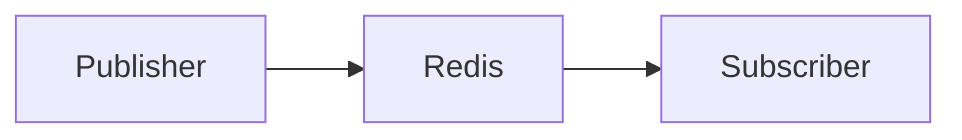
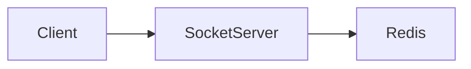
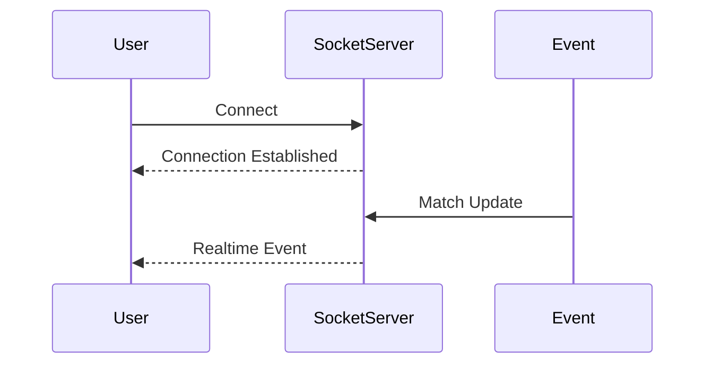
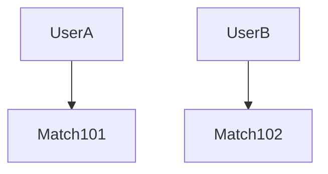
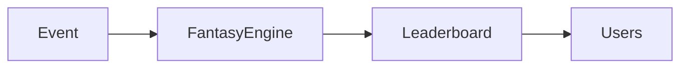
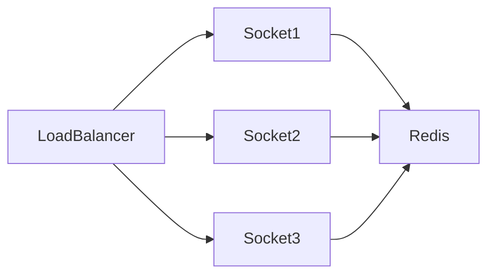

# Sportswiz Realtime Engine


## Overview

Realtime systems are one of the most challenging areas of software engineering.

Unlike traditional request-response applications, realtime platforms must continuously process, distribute, and synchronize information across thousands or millions of connected clients with minimal delay.

For a sports platform, user expectations are extremely high:

```text
Ball Happens

↓

Score Updates

↓

Users See Change
```

within seconds.

Any delay creates a poor user experience and reduces trust in the platform.

The Sportswiz realtime engine was designed to support:

* Live Scores
* Ball-by-Ball Updates
* Player Statistics
* Match State Changes
* Fantasy Point Updates
* Leaderboard Updates
* User Notifications

This document explores the architectural thinking behind a production-grade realtime sports delivery platform.

---

## Engineering Goals

The realtime platform was designed to achieve:

* Low Latency
* High Throughput
* Horizontal Scalability
* Fault Tolerance
* Operational Visibility
* Cost Efficiency

---

# Realtime Challenges

Sports systems generate constant event streams.

Examples:

```text id="5lfwz5"
Match Started

Boundary

Wicket

Player Milestone

Innings End

Match Finished
```

---

## User Expectations

Users expect:

```text id="wtlkwf"
Near Instant Updates
```

---

## Engineering Challenge

Deliver updates consistently at scale.

---

# Realtime Architecture




---

# Event Lifecycle

Every score update follows a predictable flow.

---

## Example

```text id="fz44lr"
Boundary Scored
```

---

## Flow



---

# Sports Data Feed Layer

External providers supply match events.

---

## Examples

* Match State
* Player Statistics
* Ball Events

---

## Requirements

* Reliability
* Low Latency
* Validation

---

# Event Ingestion Layer

Receives incoming events.

---

## Responsibilities

* Validation
* Normalization
* Deduplication

---

## Benefits

* Consistent Processing
* Reduced Errors

---

# Event Processing Layer

Transforms raw events into application state.

---

## Examples

```text id="5u2d1o"
Score Update

Leaderboard Update

Fantasy Points Update
```

---

## Benefits

* Separation Of Concerns
* Scalability

---

# Event-Driven Design

Sports workloads naturally fit event-driven architectures.

---

## Benefits

* Loose Coupling
* Independent Scaling
* High Throughput

---

## Architecture



---

# Redis Pub/Sub

Redis enables efficient event distribution.

---

## Flow



---

## Benefits

* Fast Propagation
* Low Latency

---

# Why Redis?

Engineering considerations:

---

## Fast In-Memory Operations

```text id="l6tndh"
Sub-Millisecond Access
```

---

## Simple Integration

---

## Horizontal Scalability

---

## Mature Ecosystem

---

# Socket.IO Architecture

Realtime communication requires persistent connections.

---

## Architecture



---

## Benefits

* Realtime Communication
* Efficient Delivery

---

# Connection Lifecycle



---

# Room-Based Broadcasting

Not every user requires every update.

---

## Example

```text id="z2ccqt"
Match 101 Room

Match 102 Room

Match 103 Room
```

---

## Benefits

* Reduced Traffic
* Improved Efficiency

---

# Match Channel Design

Users subscribe only to relevant matches.

---

## Architecture



---

# Fantasy Points Processing

Fantasy platforms require additional realtime calculations.

---

## Events

```text id="ovsvt9"
Runs

Wickets

Catches

Milestones
```

---

## Impact

Leaderboard updates must occur quickly.

---

# Leaderboard Updates

Realtime leaderboards introduce scalability challenges.

---

## Flow



---

# Latency Budget

Realtime systems require latency goals.

---

## Example

```text id="v15c0s"
Provider → Platform

500ms

Platform Processing

300ms

Broadcast

200ms
```

---

## Total

```text id="mwk8cf"
< 1 Second
```

---

# Horizontal Socket Scaling

A single socket server is insufficient.

---

## Architecture



---

## Benefits

* Scalability
* Fault Tolerance

---

# Fan-Out Problem

One event can impact many users.

---

## Example

```text id="i7uc13"
Wicket

↓

500,000 Users
```

---

## Challenge

Efficient distribution.

---

# Backpressure Management

Systems must handle bursts safely.

---

## Techniques

* Queueing
* Event Buffers
* Retry Policies

---

## Benefits

* Stability
* Controlled Processing

---

# Reliability Considerations

Realtime systems cannot assume perfect delivery.

---

## Strategies

* Reconnection Logic
* Event Replay
* Recovery Mechanisms

---

## Benefits

* Better User Experience

---

# Observability


Track:

* Connection Count
* Event Throughput
* Broadcast Latency
* Error Rates

---

## Benefits

* Faster Troubleshooting

---

# Capacity Planning

Key inputs:

```text id="2nm1cf"
Concurrent Users

Events Per Second

Broadcast Volume
```

---

## Goal

Predict growth requirements.

---

# Failure Scenarios

---

## Feed Delay

External provider latency.

---

## Redis Failure

Realtime propagation impact.

---

## Socket Node Failure

Connection loss.

---

## Traffic Spike

Unexpected demand surge.

---

# Mitigation Strategies

* Redundancy
* Horizontal Scaling
* Monitoring
* Automated Recovery

---

# Engineering Decisions

---

## Redis Pub/Sub

Reason:

```text id="68by0r"
Fast Event Distribution
```

---

## Socket.IO

Reason:

```text id="j9ifq4"
Mature Realtime Framework
```

---

## Room-Based Broadcasting

Reason:

```text id="ey5c5u"
Efficient Delivery
```

---

## Event-Driven Processing

Reason:

```text id="m9lxw4"
Natural Sports Workload Fit
```

---

# Real-World Scenarios

---

## Match Start

Expected impact:

```text id="r0x8cz"
Connection Surge
```

---

## Major Match Event

Expected impact:

```text id="75q3py"
Massive Broadcast Volume
```

---

## Tournament Final

Expected impact:

```text id="ywj5jy"
Peak Concurrent Users
```

---

# Engineering Tradeoffs

| Decision            | Benefit                | Tradeoff                      |
| ------------------- | ---------------------- | ----------------------------- |
| Socket.IO           | Realtime UX            | Connection Overhead           |
| Redis Pub/Sub       | Fast Delivery          | Additional Infrastructure     |
| Room-Based Design   | Efficient Broadcasting | Subscription Complexity       |
| Horizontal Scaling  | Capacity Growth        | Operational Complexity        |
| Event-Driven Design | Scalability            | Distributed System Complexity |

---

# Realtime Maturity Model

```text id="3w50i9"
Polling
    │
    ▼
WebSockets
    │
    ▼
Pub/Sub
    │
    ▼
Distributed Socket Layer
    │
    ▼
Event-Driven Realtime Platform
```

---

# Engineering Outcome

The Sportswiz realtime engine demonstrates how large-scale sports platforms can deliver low-latency user experiences under highly variable traffic conditions.

By combining event-driven processing, Redis-based distribution, horizontal socket scaling, efficient subscription models, and strong operational practices, the platform can process and distribute sports events reliably while maintaining responsiveness during major sporting events and peak traffic periods.

This architecture highlights the engineering tradeoffs and production considerations required to build realtime systems at scale.
