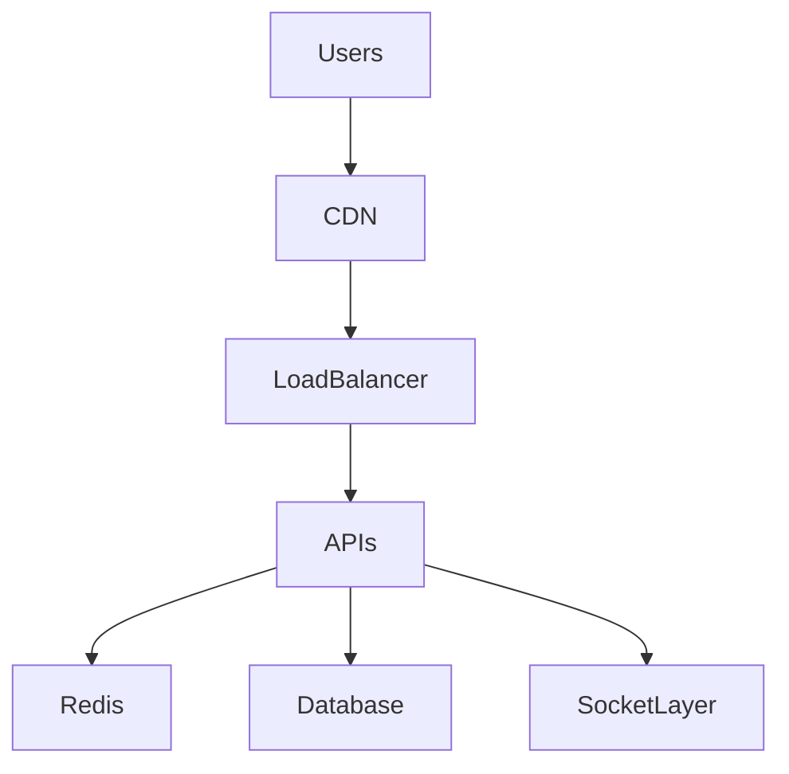
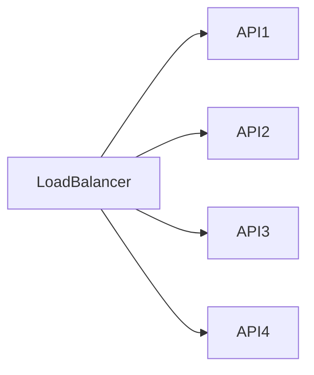
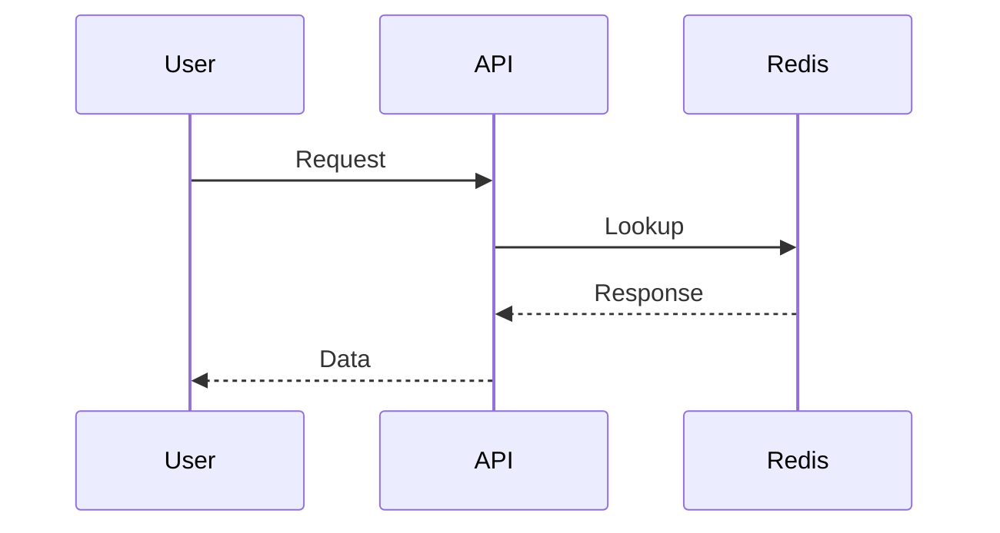
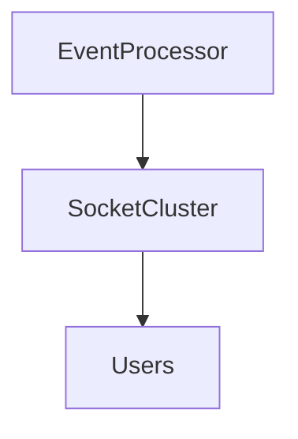
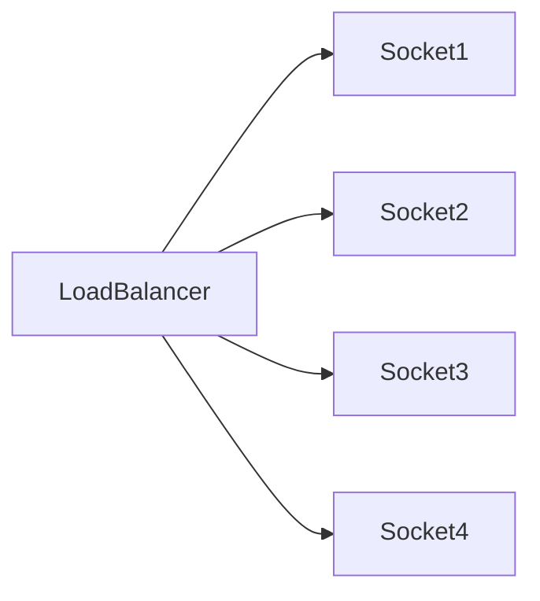
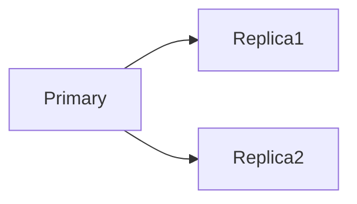
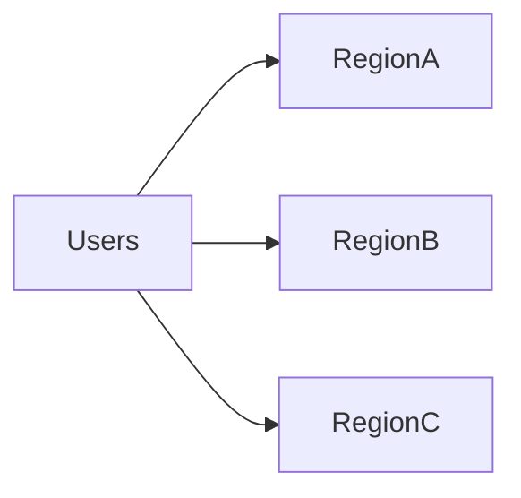

# Sportswiz Scalability Strategy


## Overview

Sports platforms experience one of the most unpredictable traffic patterns in software engineering.

Unlike traditional SaaS applications that often exhibit gradual traffic growth, sports platforms encounter:

* Sudden Traffic Surges
* Match-Day Peaks
* Viral User Growth
* Tournament-Driven Demand
* Realtime Update Storms

A platform may operate normally throughout the day and then experience a 10x–100x increase in traffic within minutes when a major match begins.

This document explores the scalability strategy behind a large-scale sports platform and the architectural decisions required to support growth while maintaining performance and reliability.

---

## Scalability Goals

The platform was designed to support:

* High Concurrent Users
* Low-Latency Updates
* Realtime Event Delivery
* Traffic Spikes
* Geographic Growth
* Operational Efficiency

---

# The Nature of Sports Traffic

Sports traffic differs significantly from traditional applications.

---

## Normal SaaS Pattern

```text
Morning
↓

Steady Growth
↓

Evening
```

---

## Sports Pattern

```text
Match Starts
↓

Massive Traffic Spike
↓

Match Ends
↓

Traffic Drops
```

---

# Peak Traffic Events

Examples:

```text
International Tournaments

League Finals

Fantasy Contest Deadlines

Breaking Sports News
```

---

## Impact

All platform layers experience load simultaneously.

---

# Scalability Architecture




---

# Scalability Philosophy

The platform follows:

```text
Scale Reads Aggressively

Protect Writes Carefully
```

This reflects sports workload characteristics.

---

# Read vs Write Traffic

Typical sports systems experience:

```text
Reads >> Writes
```

Example:

```text
1 Score Update

↓

100,000 User Reads
```

---

## Implication

Read optimization becomes critical.

---

# API Layer Scaling

APIs serve:

* Match Data
* Statistics
* Rankings
* Team Information
* User Requests

---

## Strategy

Horizontal scaling.

---

## Architecture



---

## Benefits

* Elastic Capacity
* Fault Isolation

---

# Stateless Service Design

Application instances remain stateless.

---

## Benefits

* Easy Scaling
* Simplified Recovery

---

## State Storage

Moved to:

* Redis
* Databases

---

# Redis Scaling Strategy


Redis becomes one of the most important scalability components.

---

## Cached Data

* Live Scores
* Match State
* Rankings
* Leaderboards
* Statistics

---

## Benefits

* Reduced Database Load
* Faster Response Times

---

# Redis Request Flow



---

## Result

Most requests avoid database access.

---

# Redis Clustering

As traffic grows:

```text
Single Redis

↓

Redis Cluster
```

---

## Benefits

* Horizontal Capacity
* Improved Availability

---

# Cache Warming

Popular match data is loaded proactively.

---

## Example

Before major matches:

```text
Upcoming Match Data

↓

Preloaded Into Cache
```

---

## Benefits

* Reduced Latency
* Lower Startup Load

---

# Realtime Socket Scaling


Realtime delivery creates unique scalability challenges.

---

## Problem

Each connected user consumes resources.

---

## Example

```text
500,000 Concurrent Users
```

---

# Socket Architecture



---

## Goal

Efficient event distribution.

---

# Event Fan-Out

One event may impact thousands of users.

---

## Example

```text
Boundary Scored

↓

100,000 Connected Users
```

---

## Requirement

Efficient broadcast mechanisms.

---

# Socket Horizontal Scaling



---

## Benefits

* Increased Capacity
* Fault Tolerance

---

# Database Scaling Strategy

Databases remain critical.

---

## Goals

* Reliable Writes
* Fast Reads
* Historical Storage

---

# Read Optimization

Common strategies:

* Query Optimization
* Indexing
* Read Replicas

---

## Architecture



---

# Write Protection

Writes remain centralized.

---

## Benefits

* Data Integrity
* Consistency

---

# Historical Data Growth

Sports platforms accumulate large datasets.

---

## Examples

```text
Matches

Players

Statistics

Rankings
```

---

## Requirements

* Archiving
* Retention Policies
* Analytics Storage

---

# CDN Strategy

Static assets should not hit origin systems.

---

## Examples

* Images
* Team Logos
* Media Files

---

## Benefits

* Lower Infrastructure Load
* Faster Delivery

---

# Capacity Planning

Capacity planning is critical.

---

## Inputs

* Concurrent Users
* Match Volume
* Event Frequency
* Geographic Reach

---

## Benefits

* Predictable Growth

---

# Load Testing

Scalability assumptions require validation.

---

## Scenarios

* Match Start
* Peak Match Traffic
* Tournament Finals

---

## Goals

* Bottleneck Discovery
* Capacity Validation

---

# Bottleneck Analysis

Potential bottlenecks include:

---

## Database

High query volume.

---

## Redis

Cache saturation.

---

## Socket Layer

Connection limits.

---

## APIs

Traffic bursts.

---

# Monitoring Scalability


Track:

* Requests Per Second
* Cache Hit Rate
* Active Connections
* Database Latency

---

## Benefits

* Early Detection
* Capacity Insights

---

# Geographic Scaling

Growth introduces regional considerations.

---

## Architecture



---

## Benefits

* Reduced Latency
* Improved Availability

---

# Resilience During Traffic Spikes

Scalability and reliability are connected.

---

## Strategies

* Autoscaling
* Load Balancing
* Queue-Based Processing

---

## Benefits

* Improved Stability

---

# Cost Considerations

Scaling introduces operational costs.

---

## Tradeoff

```text
Performance

vs

Infrastructure Cost
```

---

## Goal

Efficient scaling.

---

# Engineering Decisions

---

## Redis-First Reads

Reason:

```text
Reduce Database Load
```

---

## Horizontal APIs

Reason:

```text
Elastic Capacity
```

---

## Distributed Socket Layer

Reason:

```text
Massive Concurrent Connections
```

---

## Event-Driven Processing

Reason:

```text
Realtime Workloads
```

---

# Real-World Scalability Scenarios

---

## Tournament Final

Expected impact:

```text
10x Traffic

5x Realtime Connections

Massive Cache Demand
```

---

## Viral Match Event

Expected impact:

```text
Sudden Request Spike
```

---

## Fantasy Deadline

Expected impact:

```text
Heavy User Activity
```

---

# Common Scaling Mistakes

---

## Database-First Reads

Creates bottlenecks.

---

## Missing Cache Strategy

Increases latency.

---

## Stateful APIs

Complicate scaling.

---

## Weak Capacity Planning

Creates outages.

---

## No Load Testing

Leaves bottlenecks undiscovered.

---

# Engineering Tradeoffs

| Decision          | Benefit             | Cost                      |
| ----------------- | ------------------- | ------------------------- |
| Redis Caching     | Fast Reads          | Additional Infrastructure |
| Read Replicas     | Better Read Scaling | Replication Complexity    |
| Socket Clusters   | Realtime Capacity   | Operational Complexity    |
| Autoscaling       | Elastic Growth      | Cost Variability          |
| Global Deployment | Better UX           | Infrastructure Complexity |

---

# Scalability Maturity Model

```text
Single Server
      │
      ▼
Load Balanced APIs
      │
      ▼
Redis Caching
      │
      ▼
Distributed Realtime Layer
      │
      ▼
Regional Scaling
      │
      ▼
Global Sports Platform
```

---

# Engineering Outcome

The Sportswiz scalability strategy is centered around handling unpredictable traffic growth, realtime workloads, and large-scale read-heavy demand.

By combining horizontal API scaling, aggressive caching, distributed realtime delivery, database optimization, capacity planning, and observability-driven operations, the platform architecture can support substantial growth while maintaining responsiveness, reliability, and operational efficiency during high-profile sporting events.
