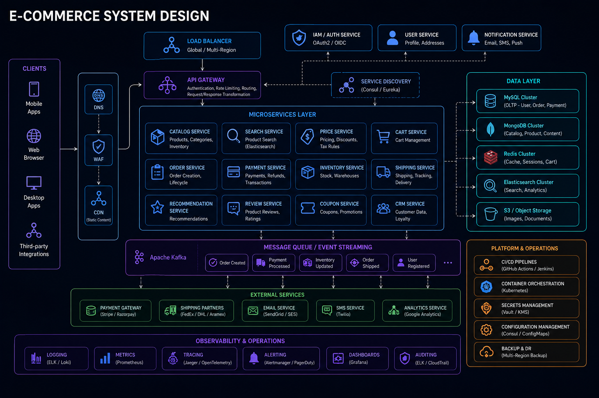
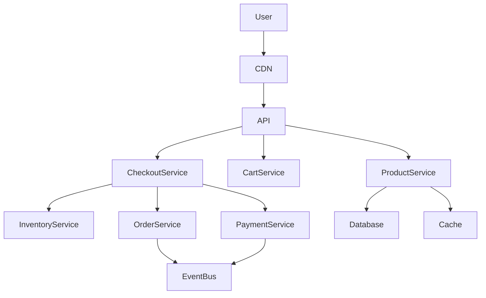
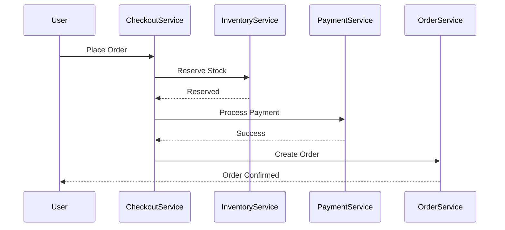
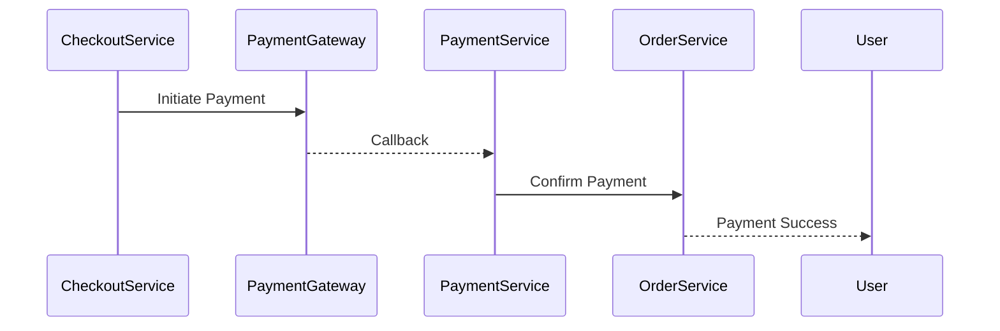
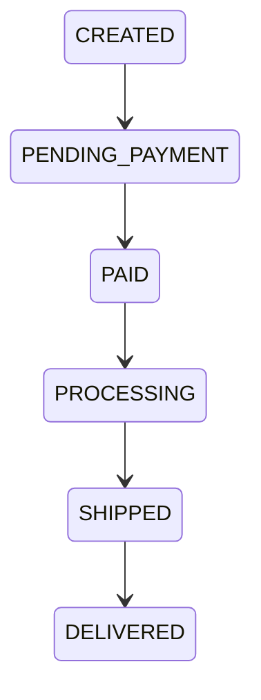

# System Design: Ecommerce Platform



## Overview

Designing a large-scale ecommerce platform requires building a **highly consistent, transactional, and scalable distributed system** that supports:

* Millions of users browsing products
* High-concurrency checkout flows
* Inventory accuracy under load
* Secure payment processing
* Order lifecycle management
* Promotions and pricing rules

Unlike social or media systems, ecommerce systems are **revenue-critical systems**, where correctness is more important than availability in key workflows.

---

## Core Requirements

### Functional Requirements

* Product browsing and search
* Cart management
* Checkout flow
* Payment processing
* Order creation and tracking
* Inventory management
* Coupons and discounts

---

### Non-Functional Requirements

* Strong consistency for orders and payments
* High availability for product browsing
* Low latency for search and catalog
* Scalability for flash sales
* Fault tolerance for payment systems
* Event-driven order processing

---

# High-Level Architecture




---

# Core Components

---

## Product Service

Responsible for:

* Product catalog
* Categories
* Variants
* Pricing display

---

## Cart Service

Responsible for:

* User cart management
* Quantity updates
* Price calculation snapshot

---

## Checkout Service

Core orchestration layer.

### Responsibilities:

* Validate cart
* Reserve inventory
* Initiate payment
* Create order

---

## Inventory Service

Responsible for:

* Stock tracking
* Reservation system
* Prevent overselling

---

## Payment Service

Handles:

* Payment gateway integration
* Transaction verification
* Refund handling

---

## Order Service

Responsible for:

* Order creation
* Order state transitions
* Order history

---

# Checkout Flow

Checkout is the most critical workflow.

---

## Flow



---

# Inventory Reservation Strategy

---

## Problem

Multiple users may buy same product simultaneously.

---

## Solution

Reservation-based model:

```text id="inventory_flow"
Available → Reserved → Paid → Confirmed
```

---

## Benefit

Prevents overselling.

---

# Payment System Design

---

## Flow



---

## Key Requirement

* Idempotent payment processing
* Retry-safe integration

---

# Order Lifecycle



---

# Cart System Design

---

## Features

* Persistent cart
* Price snapshot
* Quantity updates

---

## Challenge

Cart consistency under concurrent updates.

---

# Product Catalog System

---

## Responsibilities

* Product listing
* Filtering
* Search indexing

---

## Optimization

* CDN caching
* Redis caching
* Search indexing (Elastic-like system)

---

# Search System

---

## Features

* Keyword search
* Filters
* Sorting
* Recommendations

---

## Architecture

* Search index layer
* Cache layer
* DB fallback

---

# Event-Driven Order Processing

---

## Events

```text id="order_events"
OrderCreated
PaymentConfirmed
InventoryUpdated
OrderShipped
OrderDelivered
```

---

## Benefits

* Loose coupling
* Scalability
* Async processing

---

# Realtime Updates


---

## Flow


---

# Scalability Challenges

---

## Flash Sales

```text id="flash_sale"
Millions of users in seconds
```

---

## Inventory Locking

High contention on limited stock.

---

## Payment Spikes

External dependency bottlenecks.

---

# Optimization Strategies

* Queue-based checkout processing
* Inventory sharding
* Redis caching
* CDN for product data
* Async order workflows

---

# Database Design

Core entities:

* Users
* Products
* Orders
* Payments
* Inventory
* Carts
* Coupons

---

# Consistency Model

```text id="consistency_model"
Strong consistency → Orders, Payments, Inventory  
Eventual consistency → Product views, recommendations
```

---

# Failure Handling

---

## Payment Failure

Rollback order state.

---

## Inventory Failure

Release reservation.

---

## Checkout Failure

Retry or abort transaction.

---

# Monitoring Strategy


Track:

* Checkout success rate
* Payment success rate
* Inventory failures
* Order creation latency

---

# Engineering Tradeoffs

| Decision                    | Benefit             | Tradeoff             |
| --------------------------- | ------------------- | -------------------- |
| Inventory Reservation       | Prevent overselling | Complexity           |
| Event-driven orders         | Scalability         | Async complexity     |
| Strong consistency checkout | Correctness         | Reduced availability |
| Caching product catalog     | Performance         | Cache invalidation   |
| Payment abstraction         | Flexibility         | Integration overhead |

---

# System Design Insights

* Checkout is the most critical path
* Inventory is the hardest problem
* Payments require strong reliability
* Event-driven systems improve scalability
* Caching is essential for product discovery

---

# Engineering Outcome

The ecommerce system design demonstrates how large-scale commerce platforms are built using a combination of strong consistency systems for transactions, event-driven architectures for scalability, caching layers for performance, and distributed services for modularity.

This architecture ensures reliable order processing, accurate inventory management, secure payments, and scalable product discovery under high traffic conditions while maintaining system resilience and operational efficiency.
