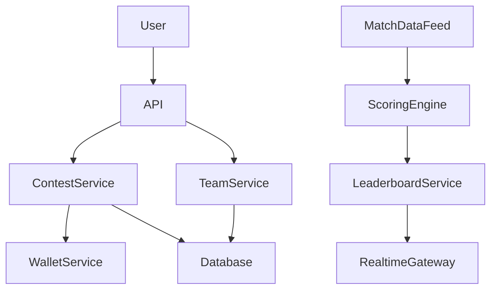
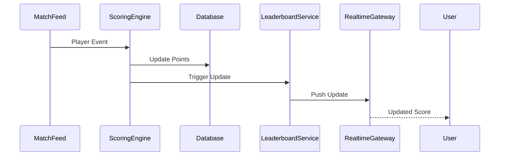

# System Design: Fantasy Sports Platform


## Overview

A fantasy sports platform is a **real-time, data-intensive, scoring-driven system** where users build virtual teams and earn points based on real-world player performances.

This system combines:

* Real-time sports data ingestion
* Scoring engines
* Leaderboard computation
* High-concurrency contest participation
* Event-driven updates
* Financial-grade correctness (for paid contests)

At scale, fantasy sports systems behave like a mix of:

```text id="mix_system"
Realtime Streaming System + Batch Analytics System + Financial Ledger System
```

---

## Core Requirements

### Functional Requirements

* Create fantasy teams
* Join contests
* Real-time player scoring updates
* Leaderboard updates
* Contest result calculation
* Wallet integration (entry fees & winnings)

---

### Non-Functional Requirements

* Extremely high concurrency during match start
* Low-latency score updates
* Accurate point calculations
* Scalable leaderboard computation
* Fault tolerance for live matches
* Event-driven processing

---

# High-Level Architecture




---

# Core Components

---

## Match Data Feed

Responsible for:

* Live match events
* Ball-by-ball updates
* Player statistics ingestion

---

## Scoring Engine

Core computation layer.

### Responsibilities:

* Convert match events into points
* Apply scoring rules
* Update player stats

---

## Leaderboard Service

Responsible for:

* Ranking users
* Contest standings
* Real-time updates

---

## Contest Service

Manages:

* Contest creation
* Entry validation
* Participation tracking

---

## Wallet Service

Handles:

* Entry fee deduction
* Winnings distribution
* Transaction history

---

# Real-Time Scoring Flow



---

# Scoring Engine Design

The scoring engine is the heart of the system.

---

## Inputs

```text id="score_input"
Runs
Wickets
Catches
Strike Rate
Economy Rate
Milestones
```

---

## Output

* Player points
* Team score
* Contest score updates

---

## Challenge

High-frequency updates during live matches.

---

# Leaderboard System

Leaderboards must update continuously.

---

## Approaches

### 1. Full Recalculation

* Expensive
* Not scalable

---

### 2. Incremental Updates (Preferred)

* Update only affected users
* Event-driven recalculation

---

## Architecture


---

# Contest System Design

---

## Types

* Free contests
* Paid contests
* Private contests
* Mega contests

---

## Flow

```text id="contest_flow"
User → Join Contest → Wallet Deduction → Team Lock → Contest Entry
```

---

# Wallet System

Fantasy platforms often include financial transactions.

---

## Responsibilities

* Entry fee collection
* Prize distribution
* Transaction history

---

## Requirement

```text id="wallet_req"
Financial correctness is critical
```

---

# Realtime Update System


---

## Flow


---

# Scalability Challenges

---

## Match Start Spike

```text id="match_spike"
Millions of users join at match start
```

---

## Scoring Burst

Continuous ball-by-ball updates.

---

## Leaderboard Pressure

Frequent recalculations.

---

## Wallet Transactions

High financial concurrency.

---

# Optimization Strategies

* Event-driven scoring
* Redis caching for leaderboards
* Partitioned contests
* Async wallet processing
* Batch updates

---

# Database Design

Core entities:

* Users
* Teams
* Players
* Contests
* Scores
* Wallet transactions

---

# Consistency Model

Fantasy systems require:

```text id="fantasy_consistency"
Strong consistency for wallet + eventual consistency for leaderboard
```

---

# Failure Handling

---

## Match Data Delay

Fallback to last known state

---

## Scoring Engine Failure

Replay events

---

## Leaderboard Lag

Use cached rankings

---

## Wallet Failure

Retry + reconciliation

---

# Monitoring Strategy


Track:

* Score update latency
* Leaderboard lag
* Wallet transaction success rate
* Match feed delays

---

# Engineering Tradeoffs

| Decision                        | Benefit           | Tradeoff                            |
| ------------------------------- | ----------------- | ----------------------------------- |
| Event-driven scoring            | Scalability       | Complexity                          |
| Incremental leaderboard updates | Performance       | Cache consistency issues            |
| Redis caching                   | Speed             | Memory overhead                     |
| Async wallet processing         | Scalability       | Financial reconciliation complexity |
| Partitioned contests            | Load distribution | Cross-contest complexity            |

---

# System Design Insights

* Scoring engines dominate complexity
* Real-time updates are critical for UX
* Wallet system behaves like financial ledger
* Leaderboard optimization is essential
* Match events drive entire system load

---

# Engineering Outcome

The fantasy sports system demonstrates how real-time scoring platforms are designed using event-driven architecture, scoring engines, distributed leaderboards, and financial-grade wallet systems to support millions of concurrent users during live sporting events with high accuracy, low latency, and strong consistency guarantees.
