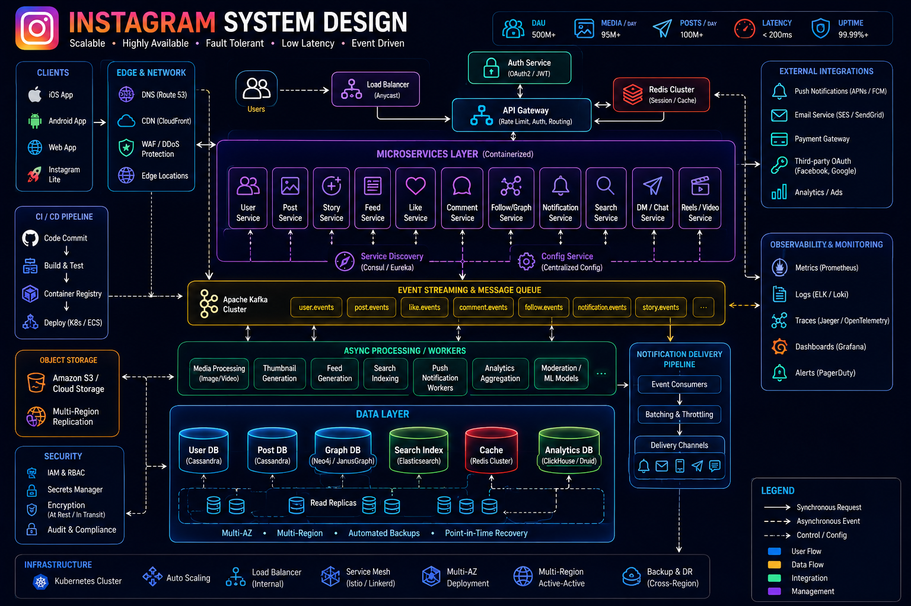
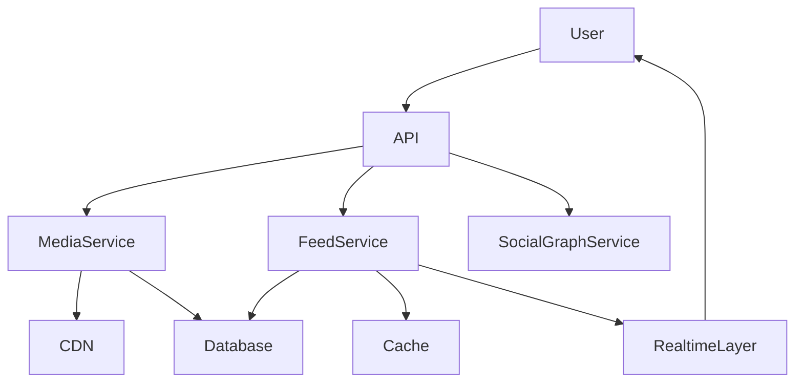
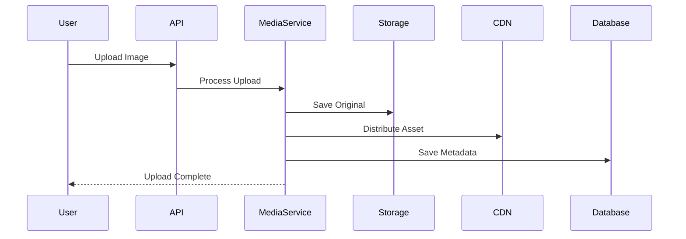
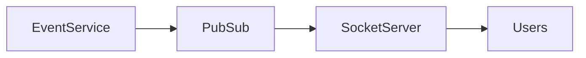

# System Design: Instagram-like Platform



## Overview

Designing an Instagram-like platform focuses heavily on:

* Media storage and delivery
* Feed generation at scale
* High-throughput image/video uploads
* CDN optimization
* Social graph interactions
* Realtime engagement systems

Unlike text-heavy platforms, Instagram is fundamentally a **media distribution system** where bandwidth, storage, and delivery latency dominate architectural decisions.

---

## Core Requirements

### Functional Requirements

* Upload photos/videos
* View personalized feed
* Like and comment on posts
* Follow/unfollow users
* Stories (ephemeral content)
* Explore/trending content
* Realtime notifications

---

### Non-Functional Requirements

* High availability
* Low latency media delivery
* Massive storage scalability
* Efficient CDN utilization
* Eventual consistency for feeds
* Global content distribution

---

# High-Level Architecture




---

# Core Components

---

## Media Service

Responsible for:

* Image/video uploads
* Compression
* Thumbnail generation
* Metadata storage

---

## CDN Layer

Serves:

* Images
* Videos
* Thumbnails

### Benefits

* Reduced latency
* Offloaded origin servers
* Global distribution

---

## Feed Service

Responsible for:

* Home feed generation
* Ranking posts
* Caching feeds

---

## Social Graph Service

Handles:

* Followers
* Following relationships
* Suggestions

---

# Media Upload Flow



---

# Feed Generation Strategy

Instagram uses a hybrid feed system.

---

## Fan-out on Write

Used for:

* Normal users
* Low follower accounts

### Flow

```text
User Post → Push to Followers Feed
```

---

## Fan-out on Read

Used for:

* High follower accounts (influencers)

### Flow

```text
User opens feed → Fetch posts dynamically
```

---

## Hybrid Model

```text
Balance between write and read scalability
```

---

# Media Storage Architecture

---

## Requirements

* Massive scale storage
* High durability
* Fast retrieval

---

## Storage Strategy

* Object storage (S3-like)
* Multi-region replication
* CDN caching

---

## Benefits

* Scalable storage
* Cost efficiency
* High availability

---

# CDN Strategy


---

## Cached Assets

* Images
* Videos
* Thumbnails
* Stories

---

## Benefits

* Reduced latency
* Global access speed
* Lower backend load

---

# Story System Design

Stories are:

* Ephemeral content (24 hours)
* High-frequency updates
* Highly read-intensive

---

## Architecture


---

## Benefits

* Fast retrieval
* Time-based expiry
* Reduced DB load

---

# Database Design

Core entities:

* Users
* Posts
* Media
* Comments
* Likes
* Follows
* Stories

---

## Scaling Strategy

* Partition posts by user_id
* Read replicas for feed queries
* Separate media metadata store

---

# Feed Ranking System

Feed is not strictly chronological.

---

## Ranking Signals

* Engagement
* Recency
* User interest
* Social proximity

---

## Result

Personalized feed experience.

---

# Realtime Interaction Layer


---

## Use Cases

* Likes
* Comments
* New followers
* Story updates

---

## Architecture



---

# Scalability Challenges

---

## Media Explosion

High volume of uploads:

```text
Millions of images per day
```

---

## Feed Fan-out Problem

One post → millions of feeds

---

## Story Expiry

High churn content management

---

## CDN Load

Massive bandwidth usage

---

# Optimization Strategies

* Image compression
* Lazy loading
* CDN edge caching
* Pre-signed URLs
* Batch feed updates

---

# Consistency Model

Instagram-like systems use:

```text
Eventual Consistency
```

---

## Reason

Availability and performance are prioritized over strict consistency.

---

# Failure Handling

---

## Media upload failure

Retry + background reprocessing

---

## Feed service failure

Fallback to direct DB query

---

## CDN failure

Fallback to origin storage

---

# Monitoring Strategy


Track:

* Upload latency
* Feed generation time
* CDN hit ratio
* Media processing delays
* Engagement events

---

# Engineering Tradeoffs

| Decision             | Benefit               | Tradeoff                      |
| -------------------- | --------------------- | ----------------------------- |
| CDN for media        | Fast delivery         | Cache invalidation complexity |
| Fan-out on write     | Fast feed reads       | High write cost               |
| Fan-out on read      | Scalable writes       | Complex reads                 |
| Eventual consistency | Scalability           | Temporary stale feeds         |
| Object storage       | Durable media storage | Retrieval latency             |

---

# System Design Insights

* Media handling dominates complexity
* CDN is critical to performance
* Feed generation is hybrid
* Stories require time-based architecture
* Realtime engagement improves UX

---

# Interview Perspective

Strong candidates discuss:

* CDN architecture
* Media processing pipelines
* Feed generation strategies
* Fan-out tradeoffs
* Story system design
* Scaling challenges for media-heavy systems

---

# Engineering Outcome

The Instagram-like system demonstrates how modern media platforms combine distributed storage, CDN-based delivery, hybrid feed generation, and realtime event systems to support massive-scale visual content consumption with high performance, global reach, and low latency user experience.
