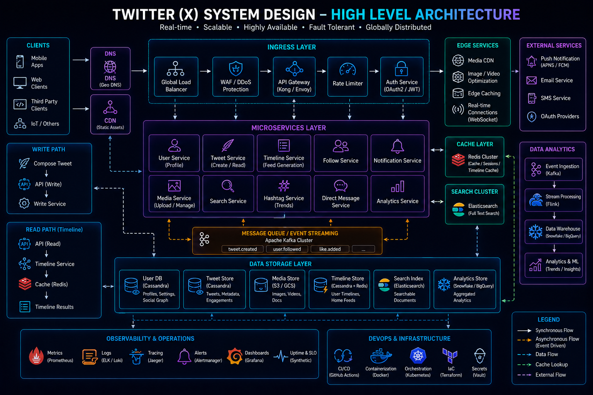
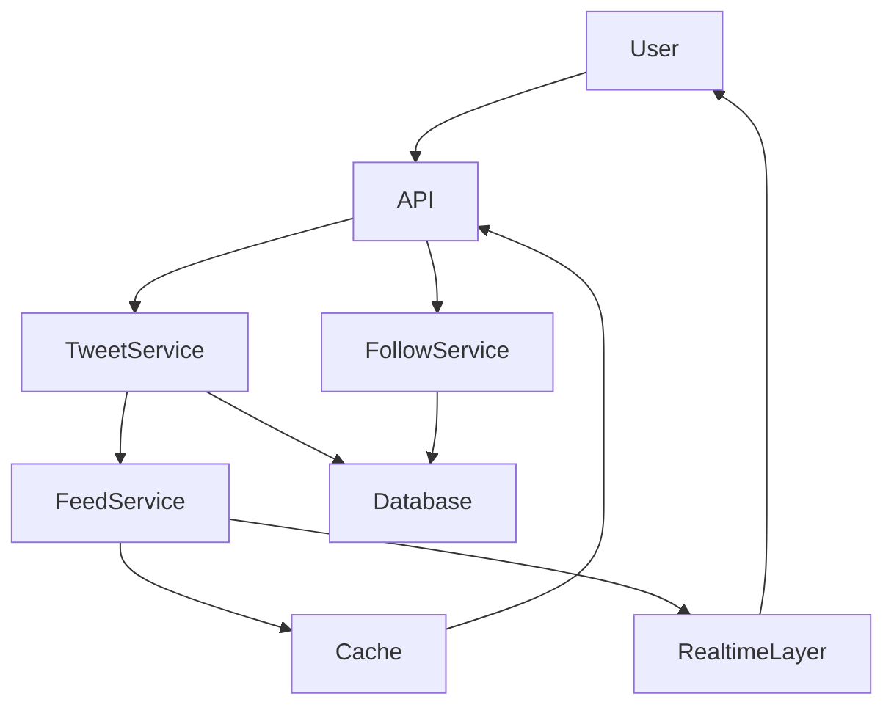
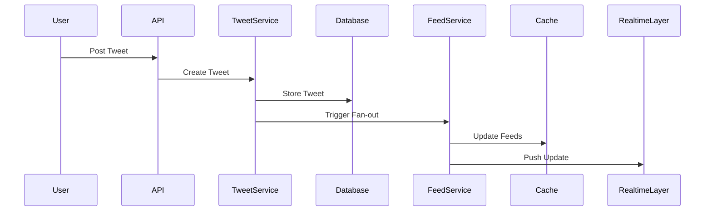
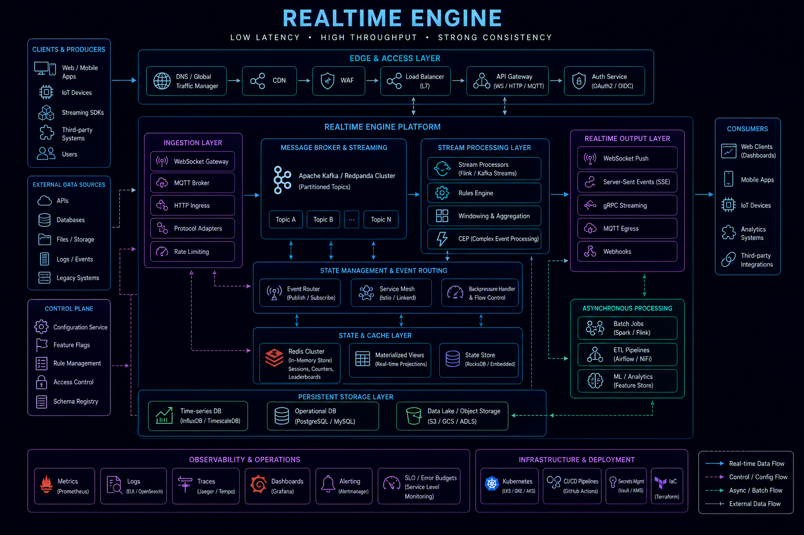
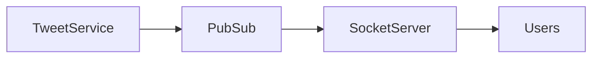

# System Design: Twitter (X-like) Platform



## Overview

Designing a Twitter-like system is a classic distributed systems problem that evaluates:

* Feed generation strategies
* Timeline ranking
* High read/write scalability
* Fan-out mechanisms
* Real-time delivery tradeoffs
* Storage design
* Caching strategies

A Twitter-style platform is fundamentally a **high-throughput event distribution system** where users continuously publish short messages and consume personalized timelines at massive scale.

---

## Core Requirements

### Functional Requirements

* Post tweets
* Follow/unfollow users
* View home timeline
* View user timeline
* Like and retweet posts
* Real-time updates

---

### Non-Functional Requirements

* High availability
* Low latency timeline generation
* Massive read scalability
* Eventual consistency for feeds
* Fault tolerance

---

# High-Level Architecture




---

# Core Components

---

## Tweet Service

Responsible for:

* Creating tweets
* Storing tweet metadata
* Validating content

---

## Follow Service

Responsible for:

* Managing follow relationships
* Fan-out graph creation

---

## Feed Service

Responsible for:

* Generating timelines
* Ranking tweets
* Caching feeds

---

## Cache Layer

Used for:

* Home timeline
* User feeds
* Trending tweets

---

## Database Layer

Stores:

* Tweets
* Users
* Relationships
* Engagement data

---

# Data Flow: Tweet Creation



---

# Feed Generation Strategies

There are two primary approaches:

---

## 1. Fan-out on Write

When a user tweets:

```text
Push tweet to all followers' feeds
```

### Pros

* Fast read time
* Simple timeline retrieval

### Cons

* Expensive writes for users with many followers

---

## 2. Fan-out on Read

When a user opens feed:

```text
Fetch tweets from all followed users
```

### Pros

* Cheap writes
* Scales for high-follower accounts

### Cons

* Slow reads
* Complex ranking logic

---

## Hybrid Approach (Preferred)

```text
Normal users → Fan-out on write  
Celebrities → Fan-out on read
```

---

# Feed Ranking

Feeds are not purely chronological.

Ranking factors:

* Recency
* Engagement
* User interest
* Relevance signals

---

# Caching Strategy


---

## Cached Data

* Home timeline
* User timeline
* Trending topics

---

## Benefits

* Reduced DB load
* Faster response times

---

# Database Design

Core entities:

* Users
* Tweets
* Follows
* Likes
* Retweets

---

## Scaling Strategy

* Horizontal sharding for tweets
* Read replicas for timelines
* Partitioned user data

---

# Realtime Updates



---

## Use Cases

* New tweet notifications
* Live engagement updates
* Trending changes

---

## Architecture



---

# Scalability Challenges

---

## Celebrity Problem

Users with millions of followers:

```text
One Tweet → Millions of Updates
```

---

## Solution

* Fan-out on read
* Hybrid feed system

---

# Storage Strategy

---

## Tweets

* Time-based partitioning
* Distributed storage

---

## Feeds

* Precomputed cache
* TTL-based cleanup

---

# Performance Optimization

* CDN for media
* Redis caching for feeds
* Batch processing for fan-out

---

# Consistency Model

Twitter-like systems use:

```text
Eventual Consistency
```

---

## Reason

Strict consistency would reduce availability.

---

# Failure Handling

---

## Feed service failure

Fallback to database fetch

---

## Cache failure

Rebuild from source

---

## Pub/Sub failure

Replay from event logs

---

# Monitoring Strategy


Track:

* Tweet latency
* Feed generation time
* Cache hit ratio
* Fan-out lag

---

# Engineering Tradeoffs

| Decision             | Benefit      | Tradeoff                |
| -------------------- | ------------ | ----------------------- |
| Fan-out on write     | Fast reads   | Expensive writes        |
| Fan-out on read      | Cheap writes | Slow reads              |
| Hybrid model         | Balanced     | Complex logic           |
| Eventual consistency | Scalability  | Temporary inconsistency |
| Caching feeds        | Performance  | Cache invalidation      |

---

# System Design Insights

* Social graphs dominate complexity
* Feed generation is the core challenge
* Read scaling is more important than write scaling
* Hybrid architectures are necessary at scale

---

# Interview Perspective

Strong candidates discuss:

* Fan-out strategies
* Feed ranking systems
* Caching layers
* Graph-based relationships
* Scalability tradeoffs
* Real-time updates

---

# Engineering Outcome

The Twitter-like system demonstrates how large-scale social platforms are designed using hybrid feed generation strategies, caching layers, distributed databases, and real-time event systems to support massive user interactions with low latency and high availability.
