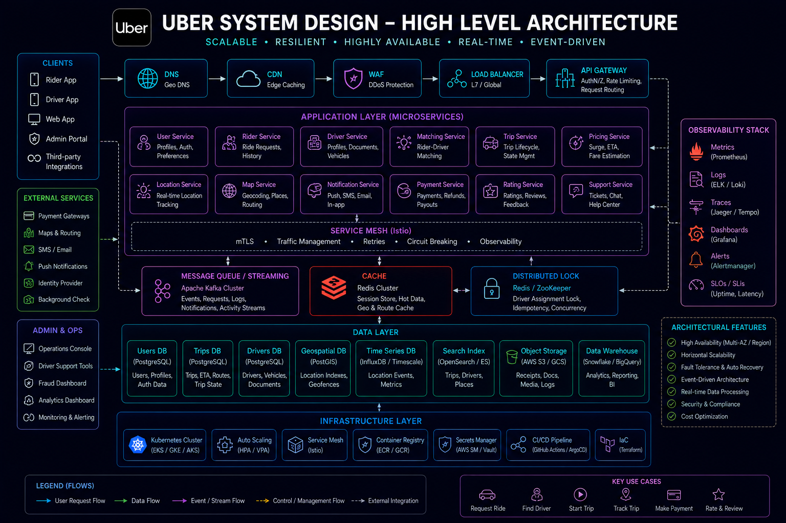
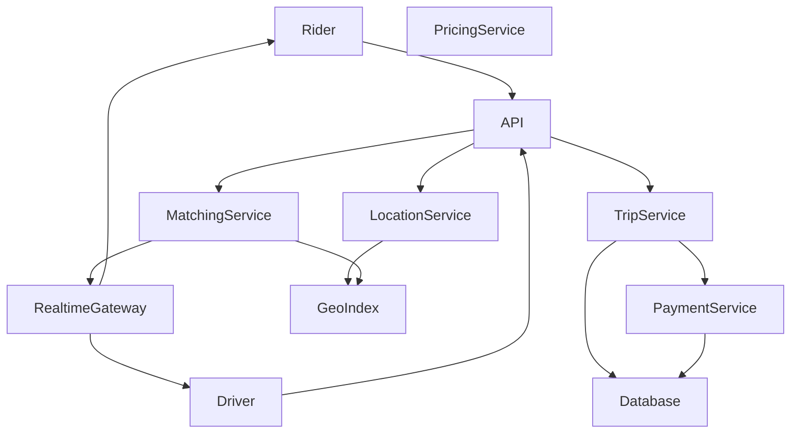
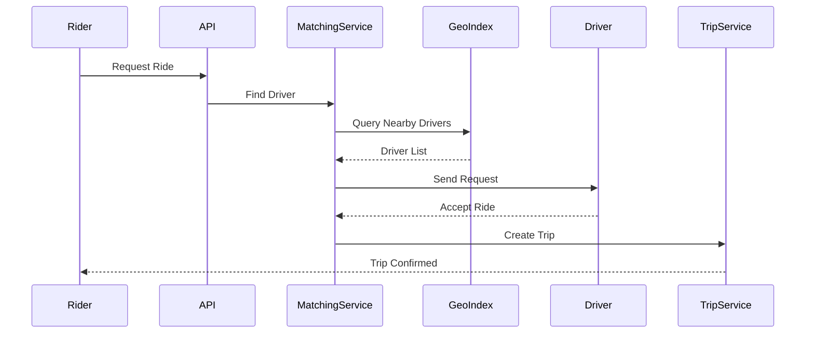
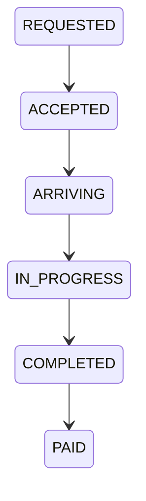
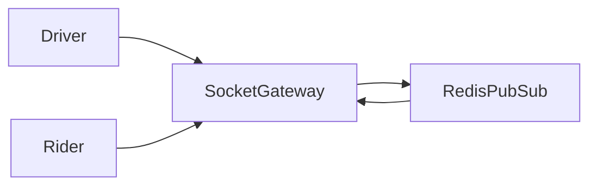

# System Design: Uber-like Ride Hailing Platform



## Overview

Designing a ride-hailing platform like Uber involves building a **real-time, location-intensive distributed system** that connects riders and drivers efficiently.

Unlike traditional backend systems, Uber requires:

* Real-time geospatial matching
* High-frequency location updates
* Low-latency decision making
* Dynamic pricing (surge pricing)
* Strong fault tolerance
* Massive concurrent user handling

At its core, Uber is a **real-time matching and optimization engine at global scale**.

---

## Core Requirements

### Functional Requirements

* Request ride
* Accept ride request
* Real-time driver location tracking
* Ride matching (rider ↔ driver)
* Trip lifecycle management
* Fare calculation
* Payment processing
* Ratings system

---

### Non-Functional Requirements

* Extremely low latency matching (<1–2 seconds)
* High availability
* Accurate geospatial queries
* Scalability to millions of drivers/riders
* Fault tolerance
* Real-time updates

---

# High-Level Architecture




---

# Core Components

---

## Location Service

Responsible for:

* Streaming driver locations
* Updating geo-index
* Maintaining real-time positions

---

## Geo Index

Critical system component for fast spatial queries.

### Techniques:

* Geohashing
* Quadtrees
* H3 indexing

---

## Matching Service

Responsible for:

* Matching riders to nearest drivers
* Optimizing allocation
* Reducing pickup time

---

## Trip Service

Manages:

* Ride lifecycle
* Trip states
* Driver/rider coordination

---

## Pricing Service

Responsible for:

* Fare calculation
* Surge pricing
* Demand-supply balancing

---

# Ride Request Flow



---

# Real-Time Location Updates

Drivers continuously stream location:

```text id="loc_stream"
Driver → GPS → Location Service → Geo Index → Matching Engine
```

---

## Frequency

* Every 1–5 seconds
* Optimized batching

---

# Geospatial Matching Strategy

---

## Problem

Find nearest available driver quickly.

---

## Solution

### GeoHash Indexing

```text id="geohash"
Divide map into grids → assign drivers → query nearby cells
```

---

## Benefits

* Fast lookup
* Scalable matching
* Efficient filtering

---

# Surge Pricing System

Dynamic pricing based on demand.

---

## Inputs

* Rider demand
* Driver availability
* Traffic conditions

---

## Output

* Multiplier pricing

---

## Formula

Surge\ Price = Base\ Price \times Demand\ Factor / Supply\ Factor

---

# Trip State Machine



---

# Realtime Communication Layer




---

# Matching Challenges

---

## High Density Areas

Too many drivers in one region.

---

## Low Density Areas

No available drivers.

---

## Solution

* Dynamic radius search
* Priority ranking

---

# Scalability Challenges

---

## Location Flooding

Millions of updates per second.

---

## Real-Time Matching Load

Continuous computation required.

---

## Geo Index Pressure

High read/write load.

---

# Optimization Strategies

* Location batching
* Region partitioning
* Geo-index caching
* Asynchronous matching

---

# Database Design

Core entities:

* Users
* Drivers
* Trips
* Payments
* Locations

---

# Monitoring Strategy


Track:

* Match latency
* Ride acceptance rate
* Driver availability
* Location update lag

---

# Engineering Tradeoffs

| Decision                      | Benefit              | Tradeoff             |
| ----------------------------- | -------------------- | -------------------- |
| GeoHash indexing              | Fast spatial queries | Approximation errors |
| Real-time updates             | Accurate tracking    | High bandwidth usage |
| Surge pricing                 | Supply balancing     | User dissatisfaction |
| Event-driven matching         | Scalability          | Complexity           |
| Continuous location streaming | Accuracy             | Infrastructure cost  |

---

# System Design Insights

* Geospatial systems are core complexity
* Real-time matching is computationally expensive
* Location streaming is the biggest scalability challenge
* Pricing systems must react to live conditions
* Event-driven architecture is essential

---

# Engineering Outcome

The Uber-like system demonstrates how real-time geospatial platforms are designed using distributed location indexing, event-driven matching, streaming updates, and dynamic pricing systems to efficiently connect supply and demand at massive global scale with low latency and high reliability.
