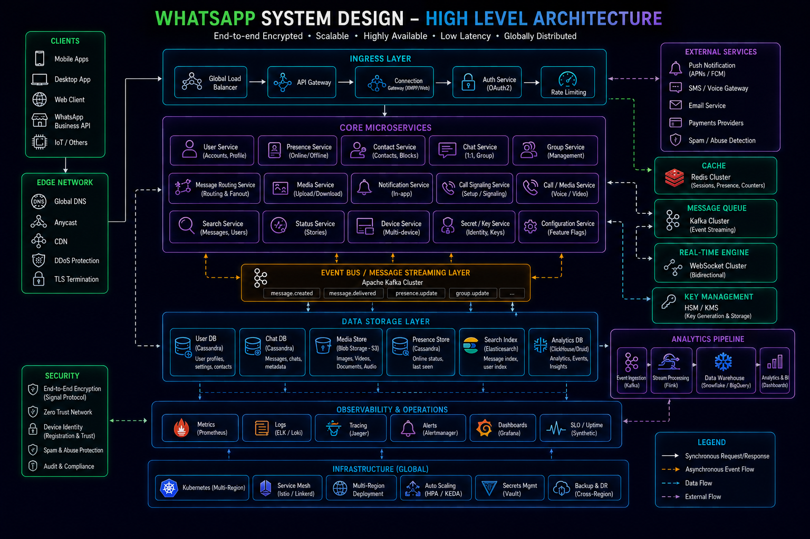
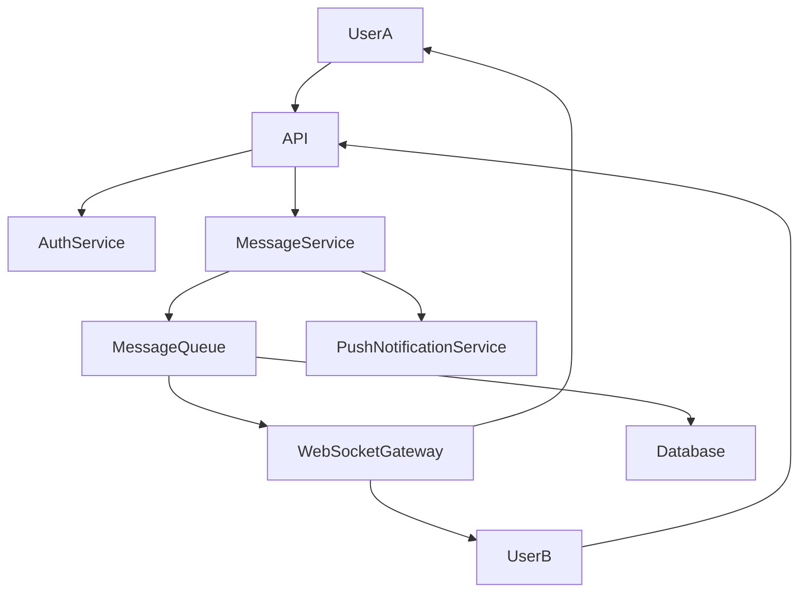
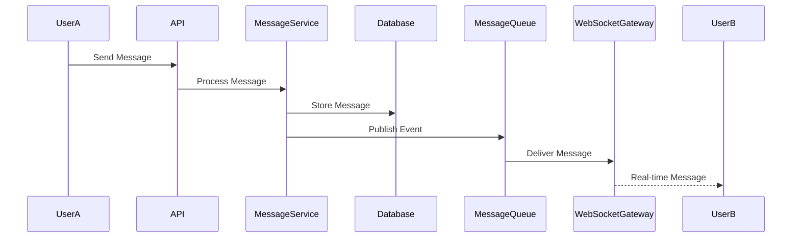
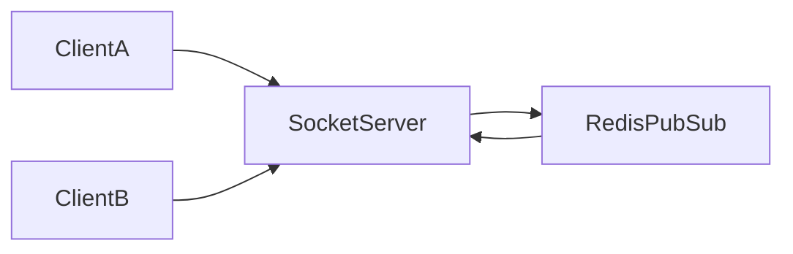
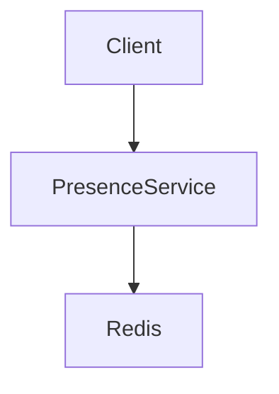

# System Design: WhatsApp-like Messaging Platform



## Overview

Designing a WhatsApp-like messaging system focuses on building a **highly reliable, low-latency, real-time communication platform** that supports billions of messages per day.

Unlike social feeds or media platforms, messaging systems require:

* Guaranteed message delivery
* Offline message support
* End-to-end encryption
* Extremely low latency (<100ms perceived delivery)
* Massive concurrent connections
* Strong consistency for message state

This is a classic **real-time distributed system at global scale**.

---

## Core Requirements

### Functional Requirements

* Send and receive messages
* One-to-one chat
* Group chat
* Message status (sent, delivered, read)
* Offline message delivery
* Media sharing (images, videos, documents)
* User presence (online/offline)

---

### Non-Functional Requirements

* Extremely low latency messaging
* High availability
* Message durability
* Horizontal scalability
* Fault tolerance
* End-to-end encryption

---

# High-Level Architecture




---

# Core Components

---

## Message Service

Responsible for:

* Message validation
* Routing messages
* Assigning message IDs
* Persisting messages

---

## WebSocket Gateway

Handles:

* Real-time message delivery
* Connection management
* Presence tracking

---

## Message Queue

Used for:

* Reliable delivery
* Decoupling services
* Retry handling

---

## Database

Stores:

* Messages
* Chat history
* User metadata

---

# Message Flow



---

# Delivery Guarantees

Messaging systems must handle failures gracefully.

---

## Delivery States

```text id="msg_states"
SENT → DELIVERED → READ
```

---

## Strategy

* Retry until acknowledged
* Persist message before delivery
* Use acknowledgments

---

# Offline Messaging

If user is offline:

```text id="offline_msg"
Store → Retry → Deliver on reconnect
```

---

## Benefits

* Reliable communication
* No message loss

---

# WebSocket Architecture




---

## Benefits

* Persistent connections
* Low latency delivery
* Efficient broadcasting

---

# Group Chat Scaling

Groups introduce fan-out complexity.

---

## Problem

```text id="group_msg"
1 message → 1000 users
```

---

## Solution

* Fan-out via queue
* Partition group processing

---

# Message Ordering

Ordering is critical in chat systems.

---

## Strategy

* Timestamp + sequence ID
* Server-side ordering

---

## Goal

Maintain conversational consistency.

---

# Encryption (E2E)

Messages must be secure.

---

## Approach

* Client-side encryption
* Server cannot read content

---

## Benefit

* Privacy protection
* Secure communication

---

# Presence System

Tracks user status:

* Online
* Offline
* Typing
* Last seen

---

## Architecture



---

# Scalability Challenges

---

## Massive Concurrent Connections

Millions of sockets simultaneously.

---

## Message Fan-out

Groups create exponential load.

---

## Storage Growth

Chat history grows indefinitely.

---

# Optimization Strategies

* Redis caching for presence
* Partitioned chat storage
* Async message delivery
* Event-driven architecture

---

# Database Design

Core entities:

* Users
* Messages
* Chats
* Groups
* Delivery receipts

---

# Monitoring Strategy


Track:

* Message latency
* Delivery success rate
* WebSocket connections
* Queue lag

---

# Engineering Tradeoffs

| Decision             | Benefit             | Tradeoff                 |
| -------------------- | ------------------- | ------------------------ |
| WebSockets           | Real-time messaging | Connection overhead      |
| Queue-based delivery | Reliability         | Added latency            |
| E2E encryption       | Privacy             | No server-side analytics |
| Message persistence  | Durability          | Storage cost             |
| Redis presence       | Fast status         | Memory usage             |

---

# System Design Insights

* Messaging is a real-time distributed system problem
* Delivery guarantees are critical
* WebSocket scaling is a core challenge
* Offline support defines reliability
* Group messaging introduces fan-out complexity

---

# Engineering Outcome

The WhatsApp-like architecture demonstrates how real-time messaging platforms are designed using WebSockets, message queues, persistent storage, and distributed systems principles to ensure reliable, secure, and low-latency communication at global scale.
