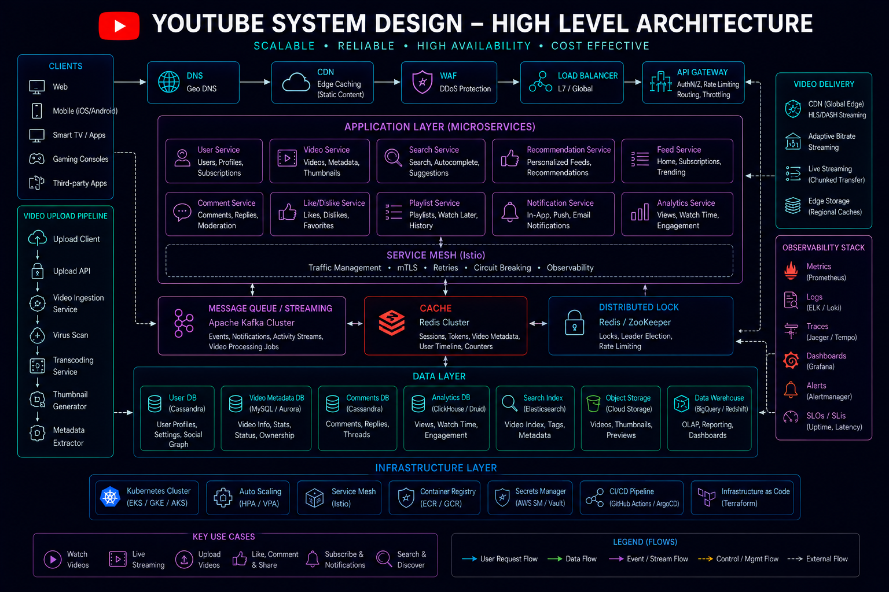
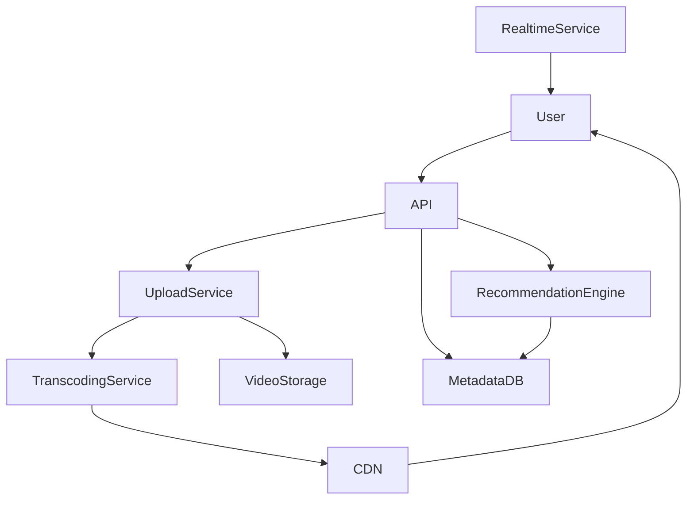
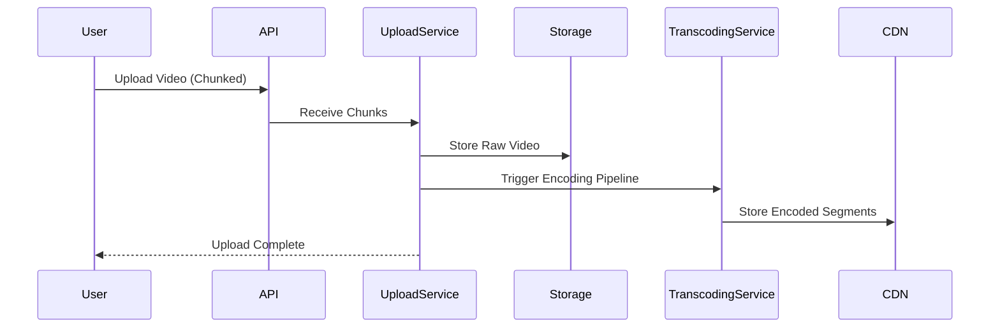
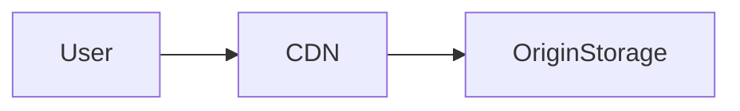
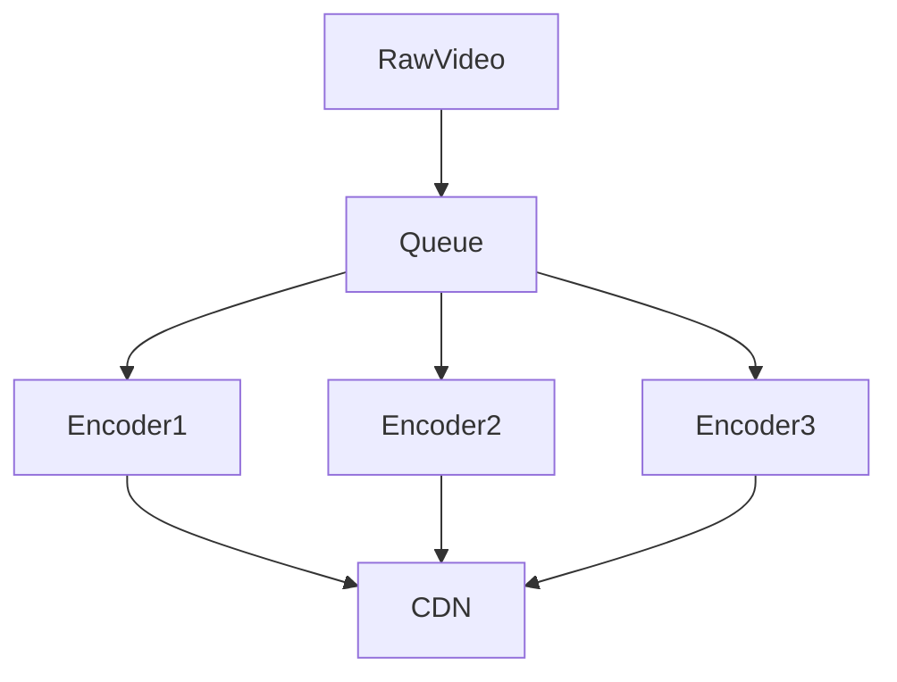
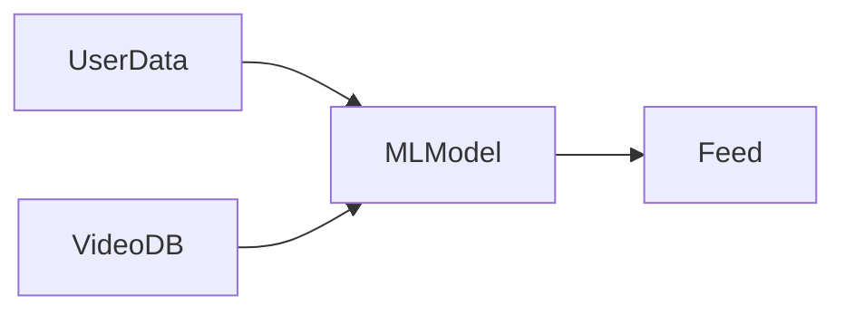
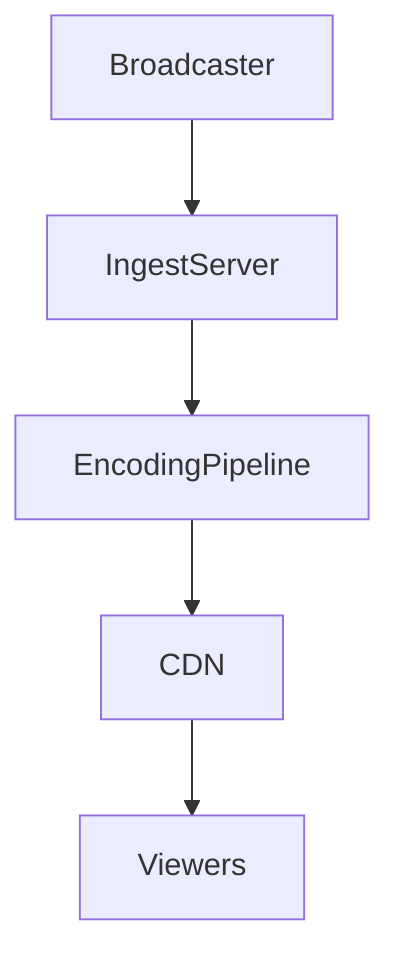

# System Design: YouTube-like Video Platform



## Overview

Designing a YouTube-like platform is a large-scale distributed systems problem focused on:

* Video ingestion and upload pipelines
* Transcoding and encoding systems
* Global CDN distribution
* High-throughput streaming delivery
* Recommendation systems
* Watch history tracking
* Live streaming infrastructure

Unlike image-based platforms, video systems introduce significantly higher challenges in:

```text id="video_scale"
Storage Cost + Bandwidth + Encoding Complexity + Latency Constraints
```

---

## Core Requirements

### Functional Requirements

* Upload videos
* Stream videos
* Search videos
* Like, comment, subscribe
* View recommendations
* Live streaming support
* Watch history tracking

---

### Non-Functional Requirements

* Massive scalability (billions of views)
* Low buffering playback
* Global content delivery
* High availability
* Fault-tolerant processing pipelines
* Efficient storage and encoding

---

# High-Level Architecture




---

# Core Components

---

## Upload Service

Responsible for:

* Receiving video uploads
* Chunked upload handling
* Validating file integrity
* Initiating encoding pipeline

---

## Transcoding Service

One of the most critical components.

### Responsibilities:

* Convert video into multiple resolutions:

  * 240p
  * 480p
  * 720p
  * 1080p
  * 4K

* Optimize compression

* Generate adaptive bitrate streams

---

## Video Storage

Stores:

* Raw uploaded video
* Transcoded segments
* Metadata references

---

## CDN Layer

Handles:

* Global video delivery
* Edge caching
* Adaptive streaming segments

---

# Video Upload Flow



---

# Video Streaming Architecture

Streaming is optimized using segmented delivery.

---

## HLS/DASH Streaming

Videos are split into small chunks:

```text id="segments"
Segment 1
Segment 2
Segment 3
...
```

---

## Benefits

* Adaptive bitrate switching
* Reduced buffering
* CDN efficiency

---

# CDN-Based Delivery


---

## Flow



---

## Benefits

* Low latency playback
* Reduced origin load
* Global scalability

---

# Transcoding Pipeline

---

## Problem

Raw videos cannot be streamed efficiently.

---

## Solution

Distributed encoding pipeline:



---

## Benefits

* Parallel processing
* Scalable encoding
* Multi-resolution output

---

# Recommendation System

YouTube-like systems are recommendation-heavy.

---

## Inputs

* Watch history
* Likes
* Search history
* Engagement signals

---

## Outputs

* Personalized feed
* Trending videos
* Suggested content

---

## Architecture



---

# Live Streaming Architecture

---

## Requirements

* Real-time video ingestion
* Low latency delivery
* Viewer synchronization

---

## Flow



---

## Benefits

* Real-time streaming
* Scalable audience support

---

# Metadata Storage

Stores:

* Video title
* Description
* Tags
* Engagement metrics
* Channel data

---

## Goals

* Fast queries
* Search indexing
* Analytics support

---

# Search System

YouTube search is a large-scale indexing system.

---

## Features

* Keyword search
* Ranking
* Autocomplete

---

## Architecture

* Elasticsearch / distributed index
* Ranking layer
* Cache for trending queries

---

# Watch History System

Tracks user engagement.

---

## Use Cases

* Recommendations
* Resume playback
* Analytics

---

# Scalability Challenges

---

## Video Storage Explosion

```text id="scale_storage"
Petabytes of video content
```

---

## Encoding Cost

CPU-intensive pipeline.

---

## Global Bandwidth Demand

High CDN pressure.

---

## Recommendation Load

Heavy ML computation.

---

# Optimization Strategies

* Chunked uploads
* Multi-region CDN
* Precomputed recommendations
* Lazy loading thumbnails
* Adaptive bitrate streaming

---

# Consistency Model

YouTube-like systems use:

```text id="yt_consistency"
Eventual Consistency
```

---

## Reason

Scale and availability are prioritized over immediate consistency.

---

# Failure Handling

---

## Upload failure

Retry chunk uploads

---

## Encoding failure

Retry pipeline job

---

## CDN failure

Fallback to origin storage

---

## Recommendation failure

Fallback to trending videos

---

# Monitoring Strategy


Track:

* Video upload success rate
* Encoding latency
* CDN hit ratio
* Buffering rate
* Watch time metrics

---

# Engineering Tradeoffs

| Decision               | Benefit     | Tradeoff                |
| ---------------------- | ----------- | ----------------------- |
| Chunked Uploads        | Reliability | Complexity              |
| Transcoding Pipeline   | Quality     | Costly computation      |
| CDN Delivery           | Low latency | Cache complexity        |
| Eventual Consistency   | Scalability | Temporary inconsistency |
| Recommendation Systems | Engagement  | High compute cost       |

---

# System Design Insights

* Video pipelines dominate complexity
* Encoding is the most expensive operation
* CDN is critical for scalability
* Recommendations drive engagement
* Streaming requires adaptive delivery

---

# Interview Perspective

Strong candidates discuss:

* Video encoding pipelines
* CDN-based streaming
* Chunked uploads
* HLS/DASH protocols
* Recommendation systems
* Live streaming architecture

---

# Engineering Outcome

The YouTube-like system demonstrates how large-scale video platforms combine distributed storage, encoding pipelines, global CDN delivery, and machine learning-driven recommendation systems to support massive video consumption at global scale with high reliability, performance, and scalability.
