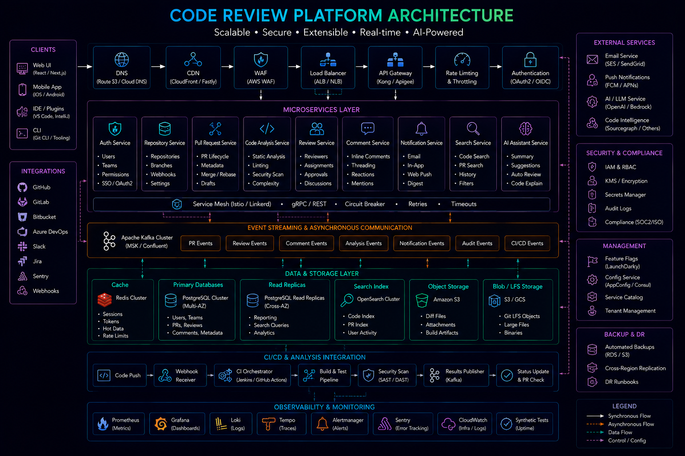

# Code Review Principles for Senior Engineers



## Overview

Code review is not a validation step.

It is a **system quality control mechanism**.

At scale, code review determines:

* System reliability
* Long-term maintainability
* Team engineering standards
* Production stability
* Knowledge distribution across teams

Senior engineers use code review to enforce **thinking quality, not just syntax correctness**.

---

## Core Principle

```text id="review_principle"
Good code review improves code  
Great code review improves engineers  
Staff-level review improves systems
```

---

# Objectives of Code Review

Code review should ensure:

* Correctness
* Simplicity
* Scalability awareness
* Maintainability
* Production safety
* Consistency with architecture

---

# What Code Review is NOT

* Not a style checker only
* Not a personal preference debate
* Not a blocking gate for minor issues
* Not a replacement for design thinking

---

# Code Review Layers

## 1. Functional Correctness

Does the code work as intended?

* Edge cases handled?
* Inputs validated?
* Logic correct?

---

## 2. System Impact

How does this affect the system?

* Performance impact
* Database load
* Cache behavior
* Network calls

---

## 3. Scalability Impact

Will this scale?

```text id="scale_check"
1 user → 1M users behavior difference?
```

---

## 4. Failure Handling

What happens when it breaks?

* Retry logic?
* Fallback?
* Graceful degradation?

---

## 5. Observability

Can we debug it in production?

* Logs present?
* Metrics available?
* Tracing supported?

---

# Senior-Level Review Questions

## Architecture Awareness

* Does this align with system design?
* Is this introducing unwanted coupling?

---

## Data Safety

* Are we corrupting state?
* Is this idempotent?

---

## Performance

* Are we adding unnecessary DB calls?
* Any N+1 query risks?

---

## Concurrency

* What happens under parallel execution?
* Race conditions possible?

---

## Failure Scenarios

* What breaks at scale?
* What happens during partial outage?

---

# Example Review Thinking

## Bad Approach

```text id="bad_review"
"This looks fine"
```

---

## Senior Approach

```text id="good_review"
This introduces a synchronous DB call in a high-traffic path  
which may not scale under peak load. Consider caching or batching.
```

---

# Common Code Smells

## 1. Tight Coupling

Services directly dependent on each other.

---

## 2. Hidden Side Effects

Functions modifying state unexpectedly.

---

## 3. Over-Engineering

Complex solutions for simple problems.

---

## 4. Missing Error Handling

No fallback or retry logic.

---

## 5. Inefficient Queries

Unoptimized database usage.

---

# Performance Review Checklist

* Are we making unnecessary network calls?
* Can this be cached?
* Is this batchable?
* Are we duplicating computation?

---

# Scalability Review Checklist

* What happens at 10x traffic?
* Does this introduce bottlenecks?
* Is this horizontally scalable?
* Is state shared correctly?

---

# Reliability Review Checklist

* Does this fail gracefully?
* Is retry logic needed?
* Is there fallback behavior?
* Are we logging failures?

---

# Data Integrity Review

* Are writes atomic?
* Is this idempotent?
* Are we risking partial updates?

---

# API Design Review

* Is API intuitive?
* Is it backward compatible?
* Does it expose internal logic?

---

# Database Review

* Indexing correct?
* Query performance optimized?
* Risk of locking issues?

---

# Security Review

* Input validation present?
* Authentication enforced?
* Sensitive data protected?

---

# Production Readiness

Before approving code:

* Logs exist
* Metrics exist
* Alerts defined
* Rollback possible

---

# Review Mindset Shift

## Junior Engineer

```text id="junior"
Does it work?
```

---

## Senior Engineer

```text id="senior"
Will it still work under pressure?
```

---

## Staff Engineer

```text id="staff"
What does this change in the system as a whole?
```

---

# Code Review Anti-Patterns

## Nitpicking Formatting Only

Misses real risks.

---

## Delayed System Thinking

Focusing only on local changes.

---

## Ignoring Scale Context

Not considering production load.

---

## Blocking Without Alternatives

Pointing issues without solutions.

---

# Effective Feedback Structure

## Format

* Issue
* Impact
* Recommendation

---

## Example

```text id="feedback"
Issue: Synchronous DB call in request path  
Impact: Latency increase under load  
Recommendation: Introduce caching layer or async processing
```

---

# Review Ownership Model

Code review is shared responsibility:

* Author owns correctness
* Reviewer owns risk identification
* Team owns system quality

---

# Engineering Outcome

Code review is a critical engineering practice that ensures systems remain reliable, scalable, and maintainable over time.

Strong code reviews reduce production incidents, improve architecture consistency, and elevate overall engineering maturity across teams.

At senior levels, code review becomes less about code — and more about system thinking.
