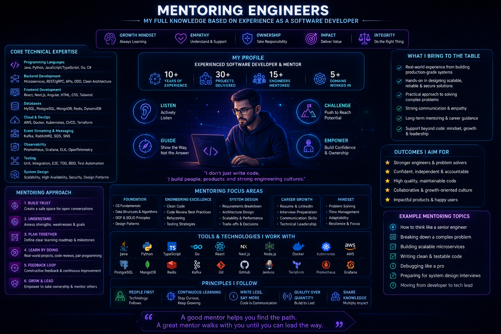

# Mentoring Engineers: Building Strong Technical Teams



## Overview

Mentoring is one of the most important responsibilities of senior engineers.

It is not about transferring knowledge — it is about **developing independent problem-solvers** who can think in systems, not just implement features.

Strong engineering teams are not built by writing more code, but by:

* Improving decision quality
* Increasing system awareness
* Encouraging ownership
* Reducing dependency on individuals

---

## Core Principle

```text id="mentor_principle"
A senior engineer writes code for today  
A mentor builds engineers for tomorrow  
A leader builds systems that outlive themselves
```

---

# Goals of Mentorship

Effective mentorship should:

* Increase engineering independence
* Improve system thinking
* Reduce production mistakes
* Strengthen decision-making ability
* Build long-term ownership mindset

---

# Levels of Engineering Growth

## 1. Task-Oriented Engineer

```text id="level1"
"I will implement what is assigned"
```

Focus:

* Code completion
* Following instructions

---

## 2. Solution-Oriented Engineer

```text id="level2"
"I will solve this problem efficiently"
```

Focus:

* Problem-solving
* Basic optimization

---

## 3. System-Oriented Engineer

```text id="level3"
"How does this affect the system?"
```

Focus:

* Architecture awareness
* Scalability considerations

---

## 4. Ownership-Oriented Engineer

```text id="level4"
"I own this system in production"
```

Focus:

* Reliability
* Monitoring
* Incident response

---

# Mentoring Strategy

## 1. Ask Better Questions

Instead of giving answers:

* “What happens at 10x traffic?”
* “What breaks if this fails?”
* “How will this scale?”

---

## 2. Encourage Tradeoff Thinking

Every decision has tradeoffs:

* Performance vs simplicity
* Speed vs correctness
* Cost vs scalability

---

## 3. Focus on System Impact

Help engineers understand:

* Downstream dependencies
* Data flow implications
* Production behavior

---

## 4. Promote Ownership

Engineers should:

* Monitor their services
* Handle incidents
* Understand failure modes

---

# Teaching System Design Thinking

## Step 1: Understand Requirements

* Functional requirements
* Non-functional requirements

---

## Step 2: Identify Constraints

* Scale expectations
* Latency requirements
* Reliability needs

---

## Step 3: Define Data Flow

* Input → Processing → Output

---

## Step 4: Identify Bottlenecks

* Database
* Cache
* Network
* Services

---

## Step 5: Optimize Iteratively

* Start simple
* Scale when needed
* Measure before optimizing

---

# Common Mentoring Mistakes

## 1. Giving Direct Answers Too Early

Reduces learning depth.

---

## 2. Over-Explaining

Creates dependency instead of independence.

---

## 3. Ignoring System Context

Focusing only on code, not architecture.

---

## 4. Not Encouraging Ownership

Engineers do not learn accountability.

---

# Effective Mentoring Techniques

## 1. Socratic Method

Instead of explaining:

* Ask guiding questions
* Let engineers reason

---

## 2. Real Incident Discussions

Use production issues:

* What failed?
* Why did it fail?
* How can we prevent it?

---

## 3. Architecture Reviews

Encourage engineers to:

* Present designs
* Defend decisions
* Evaluate tradeoffs

---

## 4. Shadowing Production Systems

Expose engineers to:

* Logs
* Metrics
* Alerts
* Real incidents

---

# Building Ownership Culture

Ownership is built when engineers:

* Understand production impact
* Participate in incident resolution
* Monitor system health
* Take responsibility for outcomes

---

# Scaling Engineering Teams

## Challenge

As teams grow:

* Communication overhead increases
* Knowledge distribution weakens
* System understanding fragments

---

## Solution

* Strong documentation
* Clear architecture boundaries
* Consistent engineering practices
* Mentorship at every level

---

# Feedback Philosophy

## Bad Feedback

```text id="bad_feedback"
"This is wrong"
```

---

## Good Feedback

```text id="good_feedback"
This may cause scalability issues under load because X  
Consider alternative approach Y to improve performance.
```

---

# Mentorship in System Design

Encourage engineers to think about:

* Scaling strategies
* Failure scenarios
* Data consistency
* Performance tradeoffs

---

# Engineering Maturity Growth

| Stage  | Focus            |
| ------ | ---------------- |
| Junior | Implementation   |
| Mid    | Problem solving  |
| Senior | System design    |
| Staff  | System evolution |

---

# Leadership Through Mentorship

True leadership is:

* Multiplying engineering capability
* Not centralizing knowledge
* Creating independent teams

---

# Engineering Outcome

Mentorship is a force multiplier in engineering organizations.

Strong mentoring improves system quality, reduces production incidents, and creates autonomous engineers capable of handling complex distributed systems without constant guidance.

Great teams are built when engineers are taught how to think, not just what to build.
