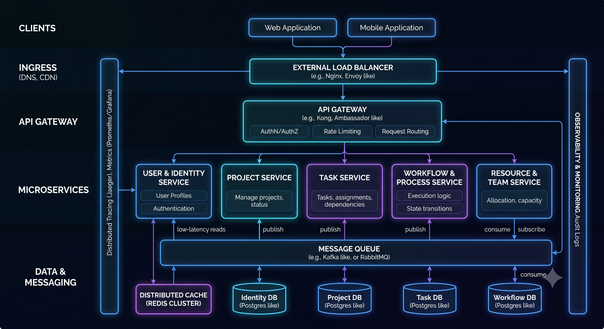

# Project Execution Framework for Senior Engineers



## Overview

Project execution is where engineering theory meets production reality.

A system design that looks perfect on paper can fail if execution is weak.

Senior engineers are evaluated not only on design quality, but on:

* Delivery consistency
* Risk management
* Execution clarity
* Cross-team coordination
* Production stability during rollout

This document defines a structured approach to executing complex engineering projects in distributed systems.

---

## Core Principle

```text id="exec_principle"
Good engineers design systems  
Great engineers deliver systems  
Staff engineers ensure systems survive production
```

---

# Project Execution Lifecycle

Every production project follows a predictable lifecycle:

```text id="lifecycle"
Discovery → Design → Planning → Implementation → Testing → Deployment → Monitoring
```

---

# Phase 1: Discovery

## Goal

Understand the problem clearly.

---

## Key Questions

* What is the problem we are solving?
* Why is it needed?
* Who are the users?
* What is the expected scale?

---

## Output

* Requirements document
* Initial constraints
* Risk identification

---

# Phase 2: System Design

## Goal

Define the architecture before writing code.

---

## Activities

* High-level architecture
* Data flow design
* Service boundaries
* Technology selection

---

## Output

* System design document
* API contracts
* Data models

---

# Phase 3: Planning

## Goal

Break system into executable tasks.

---

## Breakdown Strategy

* Service-level breakdown
* API-level breakdown
* Database schema design
* Infrastructure setup

---

## Output

* Task list
* Sprint breakdown
* Dependency mapping

---

# Phase 4: Implementation

## Goal

Build the system incrementally.

---

## Principles

* Build in small increments
* Validate each module
* Avoid large untested changes

---

## Best Practices

* Feature flags
* Modular commits
* Continuous integration

---

# Phase 5: Testing Strategy

## Types

* Unit testing
* Integration testing
* Load testing
* Chaos testing

---

## Goal

Ensure system reliability before production.

---

# Phase 6: Deployment Strategy

## Approaches

### 1. Big Bang Deployment

* Risky
* Not recommended for distributed systems

---

### 2. Incremental Deployment (Preferred)

* Gradual rollout
* Lower risk

---

### 3. Blue-Green Deployment

* Zero downtime
* Easy rollback

---

### 4. Canary Deployment

* Gradual user exposure
* Real-time validation

---

# Phase 7: Monitoring & Validation

## Goal

Ensure system stability in production.

---

## Metrics

* Latency
* Error rates
* Throughput
* Resource usage

---

## Observability Stack


---

# Risk Management in Execution

## Types of Risks

* Technical risk
* Scaling risk
* Integration risk
* Operational risk

---

## Mitigation Strategies

* Feature flags
* Gradual rollout
* Load testing
* Rollback plans

---

# Dependency Management

## Problem

Large systems depend on multiple services.

---

## Strategy

* Identify critical dependencies early
* Mock external services during development
* Add fallback mechanisms

---

# Execution Breakdown Strategy

## Example: Ecommerce Checkout System

```text id="breakdown"
Cart → Checkout → Inventory → Payment → Order → Notification
```

Each module is:

* Designed independently
* Built separately
* Tested in isolation

---

# Parallel Execution Strategy

## Principle

Multiple teams should work independently.

---

## Requirement

* Clear API contracts
* Defined service boundaries
* Minimal coupling

---

# Release Strategy

## Safe Deployment Flow

```text id="release"
Dev → Staging → Canary → Full Production
```

---

## Benefits

* Risk reduction
* Early issue detection
* Controlled rollout

---

# Failure Handling Strategy

## Expected Failures

* Service downtime
* Partial outages
* Third-party failures

---

## Response Plan

* Retry mechanisms
* Circuit breakers
* Graceful degradation

---

# Communication During Execution

## Key Principle

Execution is not just technical — it is collaborative.

---

## Practices

* Daily updates
* Architecture syncs
* Risk reporting
* Transparent blockers

---

# Monitoring During Rollout

## Critical Phase

First production release is the highest-risk moment.

---

## Monitoring Focus

* Error spikes
* Latency changes
* Resource usage
* User impact

---

# Post-Deployment Review

## Goal

Learn from production behavior.

---

## Questions

* What failed?
* What slowed down?
* What was unexpected?

---

# Execution Anti-Patterns

## 1. Big Bang Releases

Too risky for production systems.

---

## 2. Missing Observability

No visibility into system health.

---

## 3. Ignoring Dependencies

Leads to runtime failures.

---

## 4. No Rollback Plan

Increases production risk.

---

# Engineering Tradeoffs

| Approach             | Benefit             | Tradeoff             |
| -------------------- | ------------------- | -------------------- |
| Incremental Delivery | Safe releases       | Longer timeline      |
| Canary Releases      | Controlled exposure | Complex setup        |
| Feature Flags        | Flexibility         | Code complexity      |
| Microservices        | Scalability         | Operational overhead |

---

# Execution Maturity Model

```text id="maturity"
Ad-hoc Execution
        ↓
Structured Planning
        ↓
Incremental Delivery
        ↓
Automated Deployments
        ↓
Fully Observed Systems
```

---

# Staff Engineer Perspective

Staff engineers focus on:

* System-wide execution risk
* Cross-team coordination
* Production stability
* Long-term maintainability

---

# Engineering Outcome

Project execution is the bridge between design and production.

Strong execution ensures that even complex distributed systems are delivered safely, scaled correctly, and maintained reliably over time.

Engineering success is not just about building systems — it is about delivering them safely into production and ensuring they remain stable under real-world conditions.
