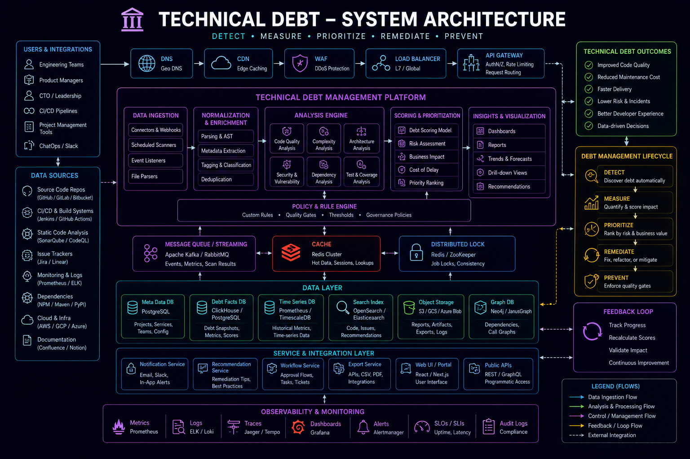

# Technical Debt Management in Production Systems



## Overview

Technical debt is inevitable in every growing engineering system.

It is not inherently bad — it is a **tradeoff between speed and long-term system health**.

What differentiates strong engineering teams is not avoiding debt, but:

* Identifying it early
* Tracking it explicitly
* Managing it strategically
* Paying it back intentionally

---

## Core Principle

```text id="debt_principle"
Technical debt is not the problem  
Unmanaged technical debt is the problem
```

---

# Types of Technical Debt

## 1. Code-Level Debt

* Duplicated logic
* Poor abstractions
* Missing tests
* Hardcoded values

---

## 2. Architecture Debt

* Tight coupling
* Monolithic bottlenecks
* Poor service boundaries

---

## 3. Infrastructure Debt

* Manual deployments
* Lack of autoscaling
* Weak observability

---

## 4. Process Debt

* Missing code reviews
* No documentation
* Weak CI/CD pipelines

---

# Why Technical Debt Accumulates

## 1. Speed Pressure

```text id="speed_pressure"
Business needs features faster than ideal engineering allows
```

---

## 2. Unclear Requirements

* Changing product direction
* Evolving system understanding

---

## 3. Lack of System Visibility

* Hidden dependencies
* Poor observability

---

## 4. Short-Term Optimization

* Quick fixes instead of scalable solutions

---

# Debt Lifecycle

```text id="debt_cycle"
Incurrence → Awareness → Accumulation → Pain → Refactor → Stability
```

---

# When Technical Debt is Acceptable

Debt is acceptable when:

* Speed is critical (startup phase)
* Feature validation is required
* System is not yet stable
* Tradeoff is explicitly understood

---

# When Technical Debt is Dangerous

Debt becomes dangerous when:

* It blocks scaling
* It increases failure rate
* It slows down development velocity
* It affects production reliability

---

# Debt Evaluation Framework

Every debt should be evaluated using:

| Factor    | Question                        |
| --------- | ------------------------------- |
| Impact    | Does it affect production?      |
| Frequency | How often does it cause issues? |
| Cost      | How expensive is it to fix?     |
| Risk      | What happens if we ignore it?   |
| Scope     | Is it localized or system-wide? |

---

# Debt Prioritization Model

## 1. Critical Debt

* Causes production failures
* Affects revenue systems

👉 Fix immediately

---

## 2. High Priority Debt

* Affects scalability or reliability

👉 Fix in next sprint cycle

---

## 3. Medium Debt

* Performance or maintainability issues

👉 Schedule for future refactor

---

## 4. Low Priority Debt

* Minor improvements

👉 Leave unless context changes

---

# Identifying Technical Debt

## Symptoms

* Frequent bugs in same module
* Slow feature development
* Increasing production incidents
* Complex code changes for simple features

---

## System Signals

* High latency endpoints
* Increasing error rates
* Deployment instability
* High rollback frequency

---

# Managing Technical Debt

## 1. Make Debt Visible

* Document it
* Track in backlog
* Tag in issues

---

## 2. Quantify Impact

* Latency increase
* Error rate
* Development delay

---

## 3. Assign Ownership

Every debt item should have:

* Owner
* Priority
* Timeline

---

## 4. Review Regularly

* Sprint reviews
* Architecture reviews
* System audits

---

# Debt vs Feature Tradeoff

## Scenario

```text id="feature_vs_debt"
Build new feature OR refactor old system
```

---

## Decision Factors

* Revenue impact
* System stability
* User experience
* Engineering velocity

---

# Architecture Debt Example

## Problem

Monolithic checkout service handling:

* Payments
* Inventory
* Orders
* Notifications

---

## Impact

* Hard to scale
* High coupling
* Deployment risk

---

## Solution

Split into domain services:

* Checkout service
* Payment service
* Inventory service

---

# Code Debt Example

## Problem

Repeated logic across services:

```text id="duplication"
Validation logic duplicated in multiple services
```

---

## Solution

* Extract shared utility
* Create validation layer

---

# Infrastructure Debt Example

## Problem

No observability:

* No logs
* No metrics
* No tracing

---

## Impact

* Debugging production issues becomes slow

---

## Solution

* Centralized logging
* Metrics dashboard
* Distributed tracing

---

# Process Debt Example

## Problem

No code review process

---

## Impact

* Inconsistent code quality
* Production bugs

---

## Solution

* Enforce PR reviews
* Define review checklist

---

# Refactoring Strategy

## Step 1: Identify Hotspots

* Most changed modules
* Most bug-prone services

---

## Step 2: Isolate Risk

* Break into smaller modules
* Add tests

---

## Step 3: Incremental Refactor

* Avoid big rewrites
* Refactor gradually

---

# Balancing Speed vs Quality

## Startup Mode

* Accept controlled debt
* Optimize for speed

---

## Scale-Up Mode

* Reduce debt
* Improve reliability

---

## Maturity Mode

* Pay down most debt
* Optimize system stability

---

# Engineering Culture Around Debt

Strong teams:

* Accept debt consciously
* Avoid hidden debt
* Discuss tradeoffs openly
* Prioritize long-term health

---

# Anti-Patterns

## 1. Ignoring Debt

Leads to system collapse over time.

---

## 2. Over-Refactoring

Slows down delivery unnecessarily.

---

## 3. Hidden Debt

Undocumented technical compromises.

---

## 4. No Ownership

No one responsible for fixing issues.

---

# Debt in Distributed Systems

In large systems:

* Small debt compounds quickly
* Cross-service dependencies amplify risk
* Debugging becomes harder

---

# Engineering Outcome

Technical debt is a natural part of software evolution.

The goal of engineering leadership is not to eliminate debt, but to manage it intelligently so that systems remain scalable, reliable, and maintainable over time.

Strong engineering teams treat debt as a **first-class engineering concern**, not an afterthought.
