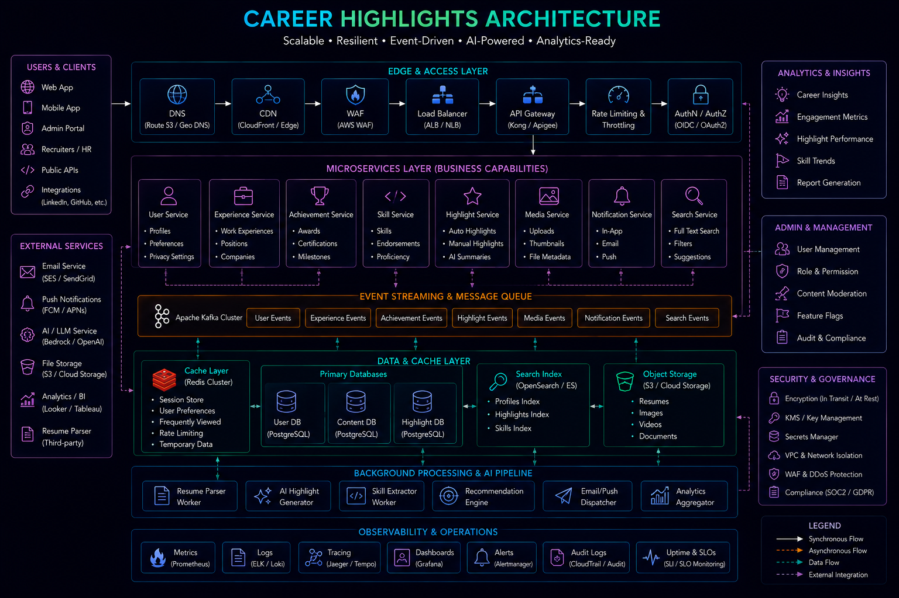

# Engineering Learning Roadmap



## Overview

This roadmap defines a structured path to grow from a **backend engineer → senior engineer → staff-level system designer**.

It focuses on:

* System thinking
* Distributed systems mastery
* Real-world architecture understanding
* Production-grade engineering skills

---

# Core Principle

```text id="roadmap_principle"
You don’t become senior by learning more tools  
You become senior by understanding systems deeply
```

---

# Phase 1: Backend Fundamentals

## Goal

Build strong foundation in backend development.

---

## Topics

* Node.js internals
* Express / NestJS / AdonisJS
* REST API design
* Authentication & authorization
* MVC architecture

---

## Outcomes

* Build clean backend APIs
* Understand request lifecycle
* Handle basic production workloads

---

# Phase 2: Databases & Data Modeling

## Goal

Understand how data flows and is stored.

---

## Topics

* MySQL deep dive
* Indexing strategies
* Query optimization
* MongoDB schema design
* Transactions & consistency

---

## Outcomes

* Efficient database design
* Optimized queries
* Reduced latency systems

---

# Phase 3: System Design Fundamentals

## Goal

Start thinking in systems, not features.

---

## Topics

* Client-server architecture
* Load balancing
* Caching strategies
* CDN basics
* API gateway patterns

---

## Outcomes

* Design basic scalable systems
* Understand bottlenecks
* Apply caching effectively

---

# Phase 4: Distributed Systems

## Goal

Understand large-scale system behavior.

---

## Topics

* Event-driven architecture
* Message queues
* Pub/Sub systems
* Microservices communication
* Failure handling patterns

---

## Outcomes

* Build decoupled systems
* Handle async workflows
* Design resilient services

---

# Phase 5: Real-Time Systems

## Goal

Build systems with instant data flow.

---

## Topics

* WebSockets
* Socket.IO
* Real-time messaging systems
* Live data streaming
* Presence systems

---

## Outcomes

* Build chat systems
* Live updates systems
* Real-time dashboards

---

# Phase 6: Advanced System Design

## Goal

Master large-scale architecture design.

---

## Systems to Study

* Twitter (feed system)
* Instagram (media system)
* YouTube (video streaming)
* WhatsApp (messaging system)
* Uber (geo-matching system)
* Ecommerce systems
* Fantasy sports systems

---

## Outcomes

* Design scalable architectures
* Handle system tradeoffs
* Understand global scale systems

---

# Phase 7: Scalability Engineering

## Goal

Handle massive traffic systems.

---

## Topics

* Horizontal scaling
* Sharding strategies
* Database partitioning
* Load balancing strategies
* Queue-based systems

---

## Outcomes

* Scale systems to millions of users
* Optimize performance bottlenecks
* Design resilient architectures

---

# Phase 8: Production Engineering

## Goal

Operate systems in real environments.

---

## Topics

* Monitoring & logging
* CI/CD pipelines
* Docker & deployment
* Alerting systems
* Incident handling

---

## Outcomes

* Production-ready systems
* Observability-driven engineering
* Faster debugging cycles

---

# Phase 9: Staff Engineer Thinking

## Goal

Think beyond implementation.

---

## Topics

* Architecture tradeoffs
* System-wide impact analysis
* Technical leadership
* Engineering decision making
* Mentorship & guidance

---

## Outcomes

* Lead system design decisions
* Evaluate long-term tradeoffs
* Influence engineering direction

---

# System Design Mastery Path

```text id="mastery_path"
Backend → Database → System Design → Distributed Systems → Real-Time → Scale → Production → Leadership
```

---

# Key Learning Strategy

## 1. Learn by Building

* Build real systems
* Implement scalable features

---

## 2. Learn by Breaking

* Analyze failures
* Study production incidents

---

## 3. Learn by Designing

* Design large-scale systems
* Compare tradeoffs

---

# Common Mistake

```text id="mistake"
Learning tools instead of learning systems
```

---

# Engineering Outcome

This roadmap builds a progression toward senior and staff engineering capabilities by focusing on systems thinking, scalability, and real-world engineering practices rather than isolated technologies.
