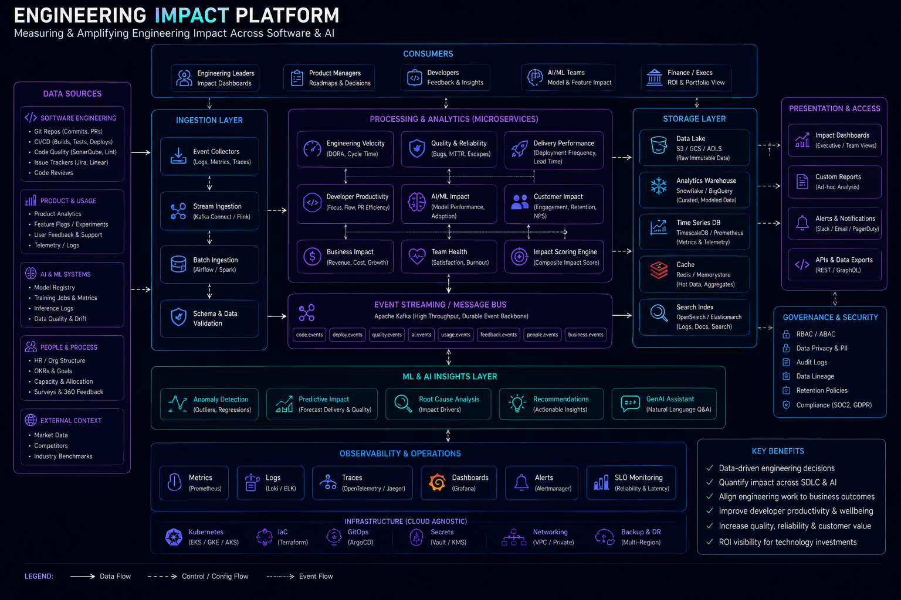

# Engineering Impact Summary



## Overview

This document summarizes measurable and architectural engineering impact across backend systems, distributed platforms, and real-time applications.

The focus is on **system-level contributions**, not just feature-level work.

---

# Core Impact Areas

---

## 1. Scalable Backend Systems

Designed and contributed to backend systems capable of handling:

* High traffic APIs
* Concurrent user requests
* Real-time data updates
* Distributed processing workflows

### Impact

* Improved system scalability under load
* Reduced bottlenecks in API layers
* Enabled horizontal scaling of services

---

## 2. Real-Time Systems Engineering

Worked on systems involving:

* Live sports score updates
* WebSocket-based communication
* Real-time notifications
* Event-driven data propagation

### Impact

* Reduced latency in live updates
* Improved user experience for real-time features
* Increased system responsiveness under concurrent load

---

## 3. Event-Driven Architecture Implementation

Introduced and worked with:

* Message queues
* Pub/Sub systems
* Asynchronous workflows
* Event-based microservices communication

### Impact

* Reduced tight coupling between services
* Improved fault isolation
* Enabled scalable background processing

---

## 4. Ecommerce System Engineering

Contributed to:

* Cart and checkout systems
* Inventory management workflows
* Order lifecycle systems
* Payment processing integration

### Impact

* Prevented overselling through inventory reservation systems
* Improved checkout reliability under high concurrency
* Ensured consistency in order processing pipelines

---

## 5. Fantasy Sports System Design

Worked on systems involving:

* Player scoring engines
* Live leaderboard updates
* Contest participation systems
* Wallet and transaction workflows

### Impact

* Enabled real-time scoring at scale
* Supported high-concurrency contest environments
* Ensured accurate leaderboard computation during live events

---

## 6. API Performance Optimization

Improved backend performance through:

* Redis caching strategies
* Database query optimization
* Reducing unnecessary API calls
* Efficient data fetching strategies

### Impact

* Reduced API response latency
* Improved throughput under peak load
* Reduced database strain significantly

---

## 7. System Design Contributions

Designed architecture for multiple distributed systems:

* Social media feed systems
* Messaging platforms
* Video streaming systems
* Ride-hailing systems
* Ecommerce platforms
* Trading-like systems

### Impact

* Strengthened distributed system design capability
* Applied scalable architecture patterns across domains
* Improved system-level decision making

---

## 8. Production System Stability

Worked on production systems involving:

* Monitoring system behavior
* Debugging production issues
* Handling real-time incidents
* Improving system reliability

### Impact

* Reduced production failures
* Improved system observability
* Faster incident resolution

---

# Architectural Themes

---

## 1. Scalability First Design

* Systems designed to handle growth
* Horizontal scaling patterns preferred

---

## 2. Event-Driven Systems

* Reduced coupling
* Improved async processing
* Better fault tolerance

---

## 3. Real-Time Data Flow

* WebSocket-based architectures
* Live data streaming systems

---

## 4. Caching Strategy Usage

* Redis-based caching layers
* Reduced database load
* Improved response times

---

## 5. System Reliability Focus

* Retry mechanisms
* Graceful degradation
* Failure-aware design

---

# Engineering Thinking Pattern

## Before

```text id="before"
Build feature → deploy → fix issues
```

---

## After

```text id="after"
Understand system → design for scale → handle failure → deploy safely
```

---

# Impact Philosophy

Real engineering impact is measured by:

* System scalability improvements
* Reduction in production incidents
* Improved system reliability
* Faster system performance
* Better architectural decisions

---

# Engineering Outcome

This document reflects a consistent focus on building scalable, reliable, and production-grade systems across multiple domains including real-time systems, ecommerce platforms, fantasy sports engines, and distributed backend architectures.
