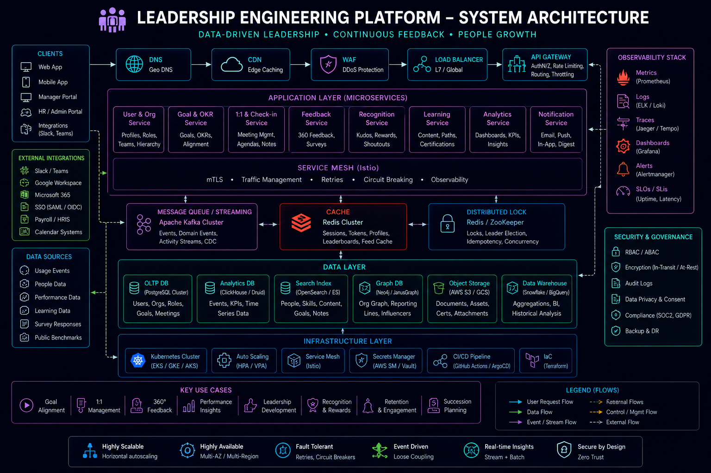

# Leadership Highlights



## Overview

This document highlights leadership qualities demonstrated through engineering ownership, system design decisions, mentoring, and production responsibility.

Leadership in engineering is not about title — it is about **influence, ownership, and decision-making quality**.

---

# Core Leadership Philosophy

```text id="leadership_principle"
A leader is not someone who manages people  
A leader is someone who improves systems and engineers around them
```

---

# Key Leadership Contributions

---

## 1. Technical Decision Ownership

* Evaluated system design tradeoffs in backend architectures
* Defined scalable patterns for distributed systems
* Made decisions impacting system reliability and performance

### Impact

* Improved system consistency
* Reduced architectural ambiguity
* Strengthened backend scalability decisions

---

## 2. System Design Leadership

Led architectural thinking for:

* Real-time sports systems
* Ecommerce backend systems
* Fantasy sports scoring engines
* Event-driven distributed systems

### Impact

* Improved system scalability planning
* Introduced event-driven design patterns
* Reduced tight coupling in system components

---

## 3. Mentoring Engineers

* Guided engineers in backend development
* Explained system design concepts
* Helped improve architecture thinking
* Encouraged ownership mindset

### Impact

* Increased team engineering maturity
* Improved code quality across projects
* Reduced dependency on senior engineers

---

## 4. Code Review Influence

* Reviewed backend architecture decisions
* Identified scalability issues early
* Suggested improvements in system design

### Impact

* Improved production readiness of systems
* Reduced architectural flaws before deployment
* Increased system reliability

---

## 5. Production Responsibility

* Handled production system behavior awareness
* Supported debugging and issue resolution
* Improved system observability mindset

### Impact

* Faster incident resolution
* Improved system stability
* Reduced recurring production issues

---

## 6. Cross-Domain System Thinking

Worked across multiple domains:

* Sports platforms
* Ecommerce systems
* Trading-style systems
* Real-time messaging systems

### Impact

* Strengthened system design adaptability
* Improved architectural flexibility
* Enabled reuse of distributed system patterns

---

# Leadership Traits Demonstrated

---

## 1. Ownership Mindset

* Treating systems as production assets
* Taking responsibility beyond assigned scope

---

## 2. Long-Term Thinking

* Prioritizing scalable solutions over quick fixes
* Considering future system growth

---

## 3. Tradeoff Awareness

* Evaluating performance vs simplicity
* Balancing scalability vs complexity

---

## 4. Communication Clarity

* Explaining system design decisions clearly
* Documenting architecture choices

---

## 5. Problem Solving Under Constraints

* Handling real-world system limitations
* Designing within production constraints

---

# Engineering Leadership Areas

---

## Backend Architecture

* Service design ownership
* API structure decisions
* Database modeling strategy

---

## Distributed Systems

* Event-driven system design
* Queue-based architectures
* Real-time data flows

---

## System Scalability

* Horizontal scaling strategies
* Caching layer design
* Load distribution approaches

---

## Reliability Engineering

* Failure handling strategies
* Retry mechanisms
* Graceful degradation design

---

# Leadership Impact Philosophy

True leadership impact is measured by:

* Engineers becoming independent
* Systems becoming more stable
* Architecture becoming more scalable
* Production incidents reducing over time

---

# Engineering Outcome

This leadership experience demonstrates the ability to:

* Influence system architecture decisions
* Guide engineering direction
* Improve team technical capability
* Ensure production system stability
* Drive scalable backend design practices

This reflects **Staff Engineer-level leadership behavior focused on systems, not hierarchy**.
