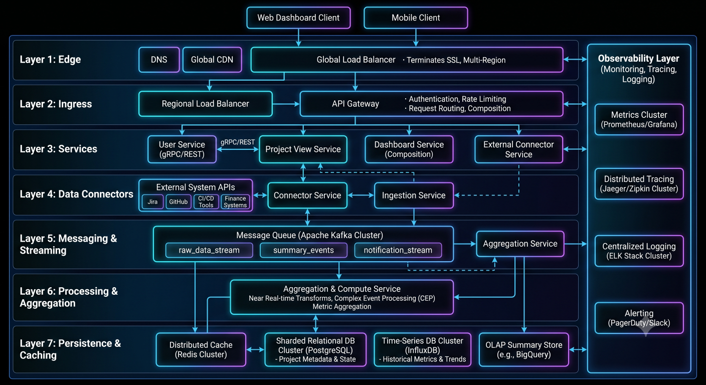

# Project Summary & System Ownership

## Overview

This document summarizes key projects, system ownership areas, and architectural contributions across multiple production-grade systems.

It highlights how different systems were designed, scaled, and maintained across backend, real-time, and distributed architectures.

---

# Core Projects

---

## 1. Sportswiz Platform (Live Sports System)

### Overview

A real-time sports platform designed for live match tracking, player statistics, and event-driven updates.

### Key Systems

* Live score engine
* Player statistics aggregation
* Real-time update system
* Backend APIs for match data

### Architecture Highlights

* Event-driven data processing
* WebSocket-based real-time updates
* Redis caching for live match data

### Impact

* Enabled real-time sports experience
* Improved performance under live traffic spikes
* Reduced latency in score updates

---

## 2. Ecommerce Platform

### Overview

A full-stack ecommerce system with cart, checkout, inventory, and order processing.

### Key Systems

* Product catalog service
* Cart management system
* Checkout orchestration flow
* Inventory reservation system
* Payment processing integration

### Architecture Highlights

* Strong consistency in order flow
* Event-driven order processing
* Redis caching for product performance

### Impact

* Prevented overselling during high traffic
* Improved checkout reliability
* Scalable order lifecycle management

---

## 3. Opinion Trading Platform

### Overview

A real-time event-driven system designed for trading-style opinion markets.

### Key Systems

* Trade execution engine
* Risk validation system
* Event processing pipeline
* Realtime market updates
* Settlement system

### Architecture Highlights

* Queue-based event processing
* Strong consistency for financial operations
* Redis-based real-time distribution

### Impact

* Enabled scalable event-driven trading flows
* Ensured correctness in financial operations
* Supported high-frequency updates

---

## 4. Fantasy Sports Platform

### Overview

A real-time scoring and leaderboard system for fantasy sports contests.

### Key Systems

* Player scoring engine
* Live leaderboard computation
* Contest management system
* Wallet transaction system
* Match data ingestion pipeline

### Architecture Highlights

* Event-driven scoring system
* Incremental leaderboard updates
* Redis-based real-time updates

### Impact

* Supported high concurrency during live matches
* Enabled real-time scoring updates
* Ensured accurate leaderboard calculations

---

# System Design Contributions

---

## 1. Social Media Systems

Designed architecture patterns for:

* Twitter-like feed system
* Instagram-like media system
* WhatsApp-like messaging system

---

## 2. Video Streaming Systems

Designed:

* YouTube-like video architecture
* CDN-based streaming pipelines
* Encoding and transcoding flows

---

## 3. Ride Hailing Systems

Designed:

* Uber-like matching system
* Geo-indexing strategies
* Real-time driver allocation systems

---

# Architectural Patterns Used

---

## 1. Event-Driven Architecture

* Async system communication
* Decoupled services
* Scalable workflows

---

## 2. Real-Time Systems

* WebSocket communication
* Live updates
* Streaming data pipelines

---

## 3. Caching Strategies

* Redis-based caching layers
* Reduced database load
* Faster response times

---

## 4. Queue-Based Processing

* Asynchronous workflows
* Load buffering
* Reliable event handling

---

# System Ownership Areas

---

## Backend Systems

* API design and optimization
* Service architecture decisions
* Database modeling

---

## Real-Time Systems

* WebSocket architecture
* Live data processing
* Event distribution systems

---

## Distributed Systems

* Event-driven workflows
* Microservice communication
* Queue-based processing systems

---

## Data Systems

* MySQL schema design
* Redis caching strategies
* Data consistency models

---

# Engineering Impact Summary

---

## 1. Scalability Improvements

* Designed systems capable of handling high concurrency
* Introduced horizontal scaling strategies
* Optimized backend performance

---

## 2. Reliability Improvements

* Implemented retry mechanisms
* Designed failure handling flows
* Improved system stability under load

---

## 3. Real-Time Performance

* Reduced latency in live systems
* Improved WebSocket-based updates
* Optimized event propagation pipelines

---

## 4. System Design Expertise

* Applied distributed system principles
* Designed multi-domain architectures
* Evaluated tradeoffs across systems

---

# Engineering Outcome

This summary reflects hands-on experience in designing, building, and scaling multiple production-grade systems across domains including sports, ecommerce, trading, messaging, and real-time platforms.

It demonstrates strong backend engineering capability with a focus on:

* Distributed system design
* Real-time architectures
* Event-driven systems
* Scalable backend infrastructure
* Production reliability
