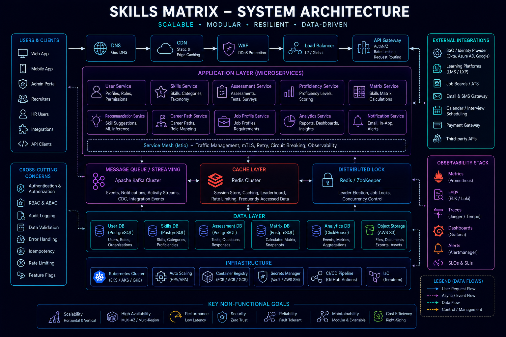

# Engineering Skills Matrix



## Overview

This document maps technical skills across backend engineering, distributed systems, real-time architecture, and system design.

It is structured to reflect **production-level capability**, not just familiarity with technologies.

---

# Core Backend Skills

---

## Node.js

### Proficiency: Advanced

* Event-driven architecture
* Asynchronous programming
* REST API design
* Performance optimization
* Middleware design

### Production Usage

* Backend services
* Real-time APIs
* Scalable microservices

---

## Express / NestJS / AdonisJS

### Proficiency: Advanced

* Modular architecture
* Service-based design
* Middleware pipelines
* Authentication systems

### Production Usage

* Ecommerce backend systems
* Sports platforms
* API gateways

---

# Databases

---

## MySQL

### Proficiency: Advanced

* Schema design
* Query optimization
* Indexing strategies
* Transaction handling

### Production Usage

* Ecommerce systems
* Order management
* Financial workflows

---

## MongoDB

### Proficiency: Intermediate

* Document-based modeling
* Flexible schemas
* Aggregation pipelines

### Production Usage

* Logging systems
* Non-relational data storage

---

# Caching & Performance

---

## Redis

### Proficiency: Advanced

* Caching strategies
* Pub/Sub systems
* Session management
* Real-time data storage

### Production Usage

* Live sports updates
* Leaderboards
* Realtime messaging systems

---

# Messaging & Event Systems

---

## Message Queues

### Proficiency: Advanced

* Event-driven architecture
* Async processing pipelines
* Decoupled system design

### Production Usage

* Order processing
* Trading systems
* Notification systems

---

# Real-Time Systems

---

## WebSockets / Socket.IO

### Proficiency: Advanced

* Persistent connections
* Real-time updates
* Event broadcasting
* Presence systems

### Production Usage

* Chat systems
* Live sports updates
* Trading systems

---

# System Design

---

## Distributed Systems

### Proficiency: Advanced

* Event-driven systems
* Microservices architecture
* Scalability patterns
* Fault tolerance strategies

---

## High-Level System Design

### Proficiency: Advanced

Designed systems including:

* Twitter-like feed systems
* Instagram media systems
* YouTube streaming systems
* WhatsApp messaging systems
* Uber ride-hailing systems
* Ecommerce platforms
* Fantasy sports systems

---

# Frontend Skills

---

## React.js

### Proficiency: Advanced

* Component architecture
* State management
* Performance optimization
* API integration

---

## Next.js

### Proficiency: Advanced

* SSR / SSG concepts
* Routing architecture
* API integration
* Production deployment patterns

---

# DevOps & Infrastructure

---

## Docker

### Proficiency: Intermediate

* Containerization basics
* Environment isolation
* Deployment workflows

---

## System Design Concepts

### Proficiency: Advanced

* Load balancing
* Horizontal scaling
* Caching strategies
* Database sharding concepts

---

# Architecture Strengths

---

## 1. Event-Driven Architecture

* Decoupled services
* Async processing pipelines

---

## 2. Real-Time Systems

* WebSocket-based systems
* Live update pipelines

---

## 3. Scalable Backend Design

* Stateless services
* Horizontal scaling patterns

---

## 4. Caching Strategies

* Redis-based optimization
* Performance tuning

---

## 5. Distributed Systems Thinking

* Fault tolerance
* System decomposition
* Service orchestration

---

# Skill Evolution Path

```text id="skill_path"
Backend → Databases → System Design → Distributed Systems → Real-Time Systems → Production Systems → Leadership Thinking
```

---

# Engineering Outcome

This skills matrix represents a strong backend engineering profile with expertise across scalable systems, real-time architectures, distributed systems, and production-grade backend development.

It reflects not just tool familiarity, but **system-level engineering capability across multiple domains**.
