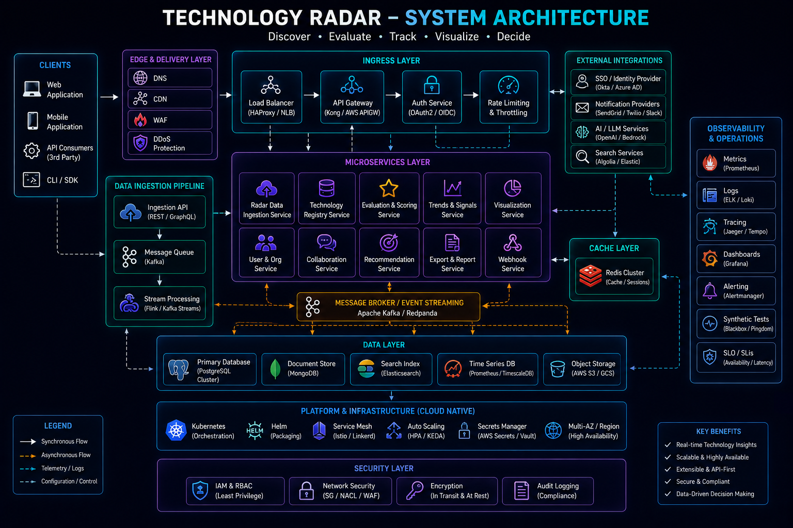

# Technology Radar & Engineering Stack Evolution



## Overview

This document defines the **technology adoption strategy and maturity levels** used across engineering systems.

A technology radar helps classify tools and systems based on:

* Production maturity
* Stability
* Scalability suitability
* Long-term maintainability
* Engineering risk level

---

# Core Principle

```text id="radar_principle"
Not every technology should be used everywhere  
Good engineers choose tools based on system needs, not popularity
```

---

# Technology Adoption Zones

---

## 1. Adopt (Production Ready)

Technologies actively used in production systems.

### Backend

* Node.js
* Express.js
* NestJS
* AdonisJS

### Databases

* MySQL
* MongoDB

### Caching & Messaging

* Redis
* Pub/Sub systems

### Frontend

* React.js
* Next.js

---

## 2. Trial (Actively Evaluated)

Technologies being explored for scalability or improvement.

* Kafka (event streaming)
* Kubernetes (container orchestration)
* GraphQL (API flexibility)
* Elasticsearch (search systems)

---

## 3. Assess (Learning / Experimental)

Technologies under evaluation:

* gRPC (service communication)
* Serverless architectures
* Distributed tracing tools
* Advanced observability stacks

---

## 4. Hold (Avoid in Production)

Technologies or patterns avoided due to risk or inefficiency.

* Overuse of microservices without need
* Tight synchronous coupling in distributed systems
* Unstructured monolithic APIs
* Missing caching in high-traffic systems

---

# Backend Stack Strategy

---

## Primary Stack

* Node.js
* Express / NestJS
* MySQL
* Redis

### Reason

* High performance
* Strong ecosystem
* Production stability
* Easy scalability

---

## Supporting Tools

* Docker (containerization)
* Redis Pub/Sub (real-time systems)
* Message queues (async processing)

---

# System Architecture Preferences

---

## 1. Modular Monolith (Preferred Starting Point)

```text id="monolith"
Simple → Scalable → Modular → Distributed (if needed)
```

---

## 2. Event-Driven Systems (At Scale)

* Used for decoupling services
* Enables async processing
* Improves scalability

---

## 3. Microservices (Selective Usage)

Used only when:

* Scaling requires separation
* Teams are independent
* System complexity justifies it

---

# Database Strategy

---

## MySQL (Primary Choice)

* Strong consistency
* Structured data
* Reliable transactions

---

## MongoDB (Secondary)

* Flexible schema
* Logging systems
* Non-relational data

---

## Redis (Performance Layer)

* Caching
* Real-time data
* Pub/Sub communication

---

# Real-Time System Strategy

---

## WebSockets

Used for:

* Chat systems
* Live updates
* Trading systems
* Sports score updates

---

## Redis Pub/Sub

Used for:

* Horizontal scaling of real-time systems
* Message propagation

---

# Scalability Strategy

---

## Horizontal Scaling First

```text id="scale_strategy"
Scale out before scaling up
```

---

## Caching First Approach

* Reduce DB load
* Improve latency
* Handle read-heavy systems

---

## Async Processing

* Queue-based workflows
* Event-driven architecture

---

# Observability Stack Strategy

---

## Adopt

* Logging systems
* Basic monitoring
* Error tracking

---

## Trial

* Distributed tracing
* Advanced metrics aggregation

---

# Architecture Evolution Strategy

```text id="evolution"
Monolith → Modular Monolith → Event-Driven → Distributed System
```

---

# Engineering Decision Strategy

Every technology decision is based on:

* System scale requirements
* Complexity tolerance
* Team capability
* Operational overhead
* Long-term maintainability

---

# Key Engineering Philosophy

* Prefer simplicity over unnecessary complexity
* Introduce distributed systems only when needed
* Optimize for clarity before optimization
* Use proven technologies for core systems

---

# Engineering Outcome

This technology radar reflects a pragmatic engineering approach focused on production stability, scalability, and maintainability, ensuring that systems evolve in a controlled and sustainable manner rather than adopting complexity prematurely.
