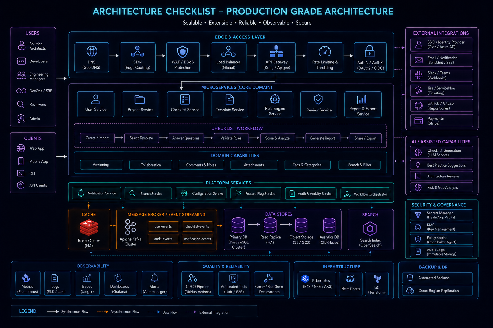

# System Architecture Checklist

## Overview

This checklist is used to validate whether a system design is **production-ready, scalable, and reliable**.

It ensures that no critical architectural aspect is missed during system design or implementation.

---

# Core Architecture Checklist

---

## 1. Requirement Validation

* Are functional requirements clearly defined?
* Are non-functional requirements specified?
* Is expected scale understood?

---

## 2. System Design Clarity

* Is high-level architecture defined?
* Are service boundaries clear?
* Is data flow properly mapped?

---

## 3. Scalability Design

* Can system handle 10x traffic?
* Are services horizontally scalable?
* Is load balancing in place?

---

## 4. Data Layer Design

* Is database schema normalized?
* Are indexes properly defined?
* Is sharding considered for scale?

---

## 5. Caching Strategy

* Is Redis or cache layer used?
* What is cache invalidation strategy?
* Are hot paths optimized?

---

## 6. Async Processing

* Are queues used for heavy tasks?
* Is event-driven architecture needed?
* Are background jobs separated?

---

## 7. Real-Time Requirements

* Are WebSockets required?
* Is Pub/Sub system needed?
* How is real-time scaling handled?

---

## 8. Failure Handling

* What happens on service failure?
* Are retries implemented?
* Is circuit breaker pattern used?

---

## 9. Observability

* Are logs implemented?
* Are metrics tracked?
* Is tracing available?

---

## 10. Security Considerations

* Is authentication implemented?
* Are APIs protected?
* Is sensitive data secured?

---

## 11. Deployment Strategy

* Is CI/CD pipeline defined?
* Is rollback strategy available?
* Is blue-green/canary deployment used?

---

# Scalability Checklist

---

## Traffic Handling

* Can system handle peak load?
* Are bottlenecks identified?

---

## Data Scaling

* Is sharding required?
* Are read replicas used?

---

## Service Scaling

* Are services stateless?
* Can instances scale horizontally?

---

# Reliability Checklist

---

## Fault Tolerance

* Does system recover from failure?
* Are retries implemented?

---

## Redundancy

* Are critical components replicated?
* Is high availability ensured?

---

## Graceful Degradation

* Does system degrade safely under load?
* Are fallback mechanisms present?

---

# Performance Checklist

---

## Latency Optimization

* Are DB queries optimized?
* Is caching used effectively?

---

## Throughput Optimization

* Are queues used for heavy tasks?
* Are batch operations implemented?

---

# Real-Time System Checklist

---

## WebSocket Design

* Are connections scalable?
* Is connection pooling handled?

---

## Event Propagation

* Is Pub/Sub system used?
* Are updates efficiently broadcast?

---

# Data Consistency Checklist

---

## Strong Consistency

* Used for financial or critical data?

---

## Eventual Consistency

* Used for feeds or non-critical data?

---

# Production Readiness Checklist

---

## Monitoring

* Are alerts configured?
* Are dashboards available?

---

## Logging

* Are logs structured?
* Is log aggregation implemented?

---

## Deployment Safety

* Is rollback possible?
* Are deployments gradual?

---

# Engineering Outcome

This checklist ensures every system design is evaluated against real-world production standards, reducing architectural risk and improving scalability, reliability, and maintainability.
