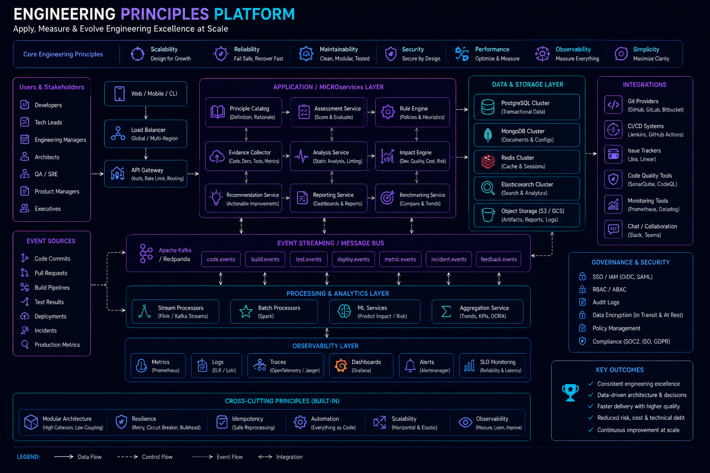

# Engineering Principles



## Overview

These principles define the **core engineering mindset** used when designing, building, and scaling production systems.

They act as a foundation for all architectural decisions, system designs, and implementation strategies.

---

# Core Engineering Principle

```text id="core_principle"
If a system cannot fail safely, it is not production-ready
```

---

# 1. Simplicity Over Complexity

## Principle

Prefer simple solutions over complex architectures.

---

## Why

* Easier to maintain
* Easier to debug
* Easier to scale

---

## Rule

```text id="simplicity_rule"
If you cannot explain it simply, it is too complex
```

---

# 2. Design for Failure

## Principle

Every system will fail — design assuming it already has.

---

## Considerations

* Network failures
* Service crashes
* Database downtime

---

## Patterns

* Retry mechanisms
* Circuit breakers
* Fallback systems

---

# 3. Scalability is a Requirement, Not an Option

## Principle

Systems must be designed for future scale from day one.

---

## Focus Areas

* Horizontal scaling
* Stateless services
* Load distribution

---

# 4. Optimize for Readability First

## Principle

Code is read more than it is written.

---

## Rule

```text id="readability_rule"
Readable code > Clever code
```

---

# 5. Consistency Depends on Context

## Principle

Not all systems require strong consistency.

---

## Examples

* Payments → Strong consistency
* Feeds → Eventual consistency

---

# 6. Prefer Asynchronous Systems for Scale

## Principle

Async processing improves scalability and resilience.

---

## Tools

* Message queues
* Event-driven systems
* Background workers

---

# 7. Cache Aggressively for Read-Heavy Systems

## Principle

Caching is essential for performance at scale.

---

## Benefits

* Reduced DB load
* Lower latency
* Higher throughput

---

# 8. Keep Systems Stateless When Possible

## Principle

Stateless systems scale horizontally.

---

## Storage Strategy

* External DB
* Redis cache
* Object storage

---

# 9. Observability is Mandatory

## Principle

If you cannot observe it, you cannot fix it.

---

## Must-Have

* Logs
* Metrics
* Tracing

---

# 10. Tradeoffs Are Always Required

## Principle

Every engineering decision has tradeoffs.

---

## Common Tradeoffs

| Choice               | Tradeoff                |
| -------------------- | ----------------------- |
| Microservices        | Complexity              |
| Monolith             | Scaling limits          |
| Strong consistency   | Latency                 |
| Eventual consistency | Temporary inconsistency |

---

# 11. Build for the Real World

## Principle

Production systems must handle unpredictable behavior.

---

## Scenarios

* Traffic spikes
* Partial outages
* Unexpected user behavior

---

# 12. Ownership is Critical

## Principle

Engineers must own systems beyond code.

---

## Responsibilities

* Monitoring
* Debugging
* Incident handling

---

# 13. Incremental Design is Better

## Principle

Do not over-engineer early.

---

## Approach

* Start simple
* Scale when needed
* Refactor continuously

---

# 14. Data is the Core of Every System

## Principle

Every system is ultimately a data system.

---

## Focus

* Data integrity
* Data flow
* Data storage

---

# Engineering Mindset Model

```text id="mindset_model"
Understand → Design → Build → Scale → Observe → Improve
```

---

# Staff Engineer Perspective

Staff engineers think in:

* Systems, not features
* Tradeoffs, not absolutes
* Failures, not just success
* Long-term evolution, not short-term delivery

---

# Engineering Outcome

These principles define the mindset required to design and operate large-scale distributed systems. They ensure systems remain scalable, maintainable, and resilient under real-world production conditions.
