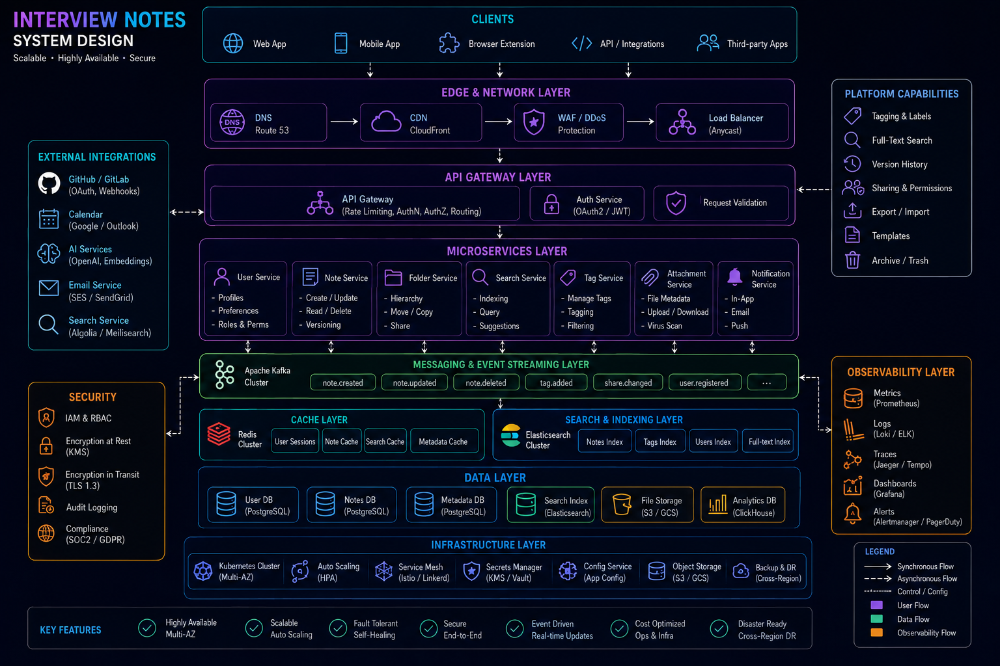

# System Design Interview Notes (Staff Engineer Level)



## Overview

This document contains **high-signal interview notes** used to solve system design problems in a structured, senior-level manner.

It focuses on:

* Thinking process
* Architecture clarity
* Tradeoff articulation
* Scalability reasoning
* Real-world system behavior

---

# Core Interview Mindset

```text id="interview_mindset"
You are not solving a problem  
You are designing a production system under constraints
```

---

# Step-by-Step Interview Strategy

---

## Step 1: Clarify Requirements

Always ask:

* What is the core feature?
* Who are the users?
* What scale are we expecting?

---

## Step 2: Define System Boundaries

Identify:

* Client layer
* API layer
* Services
* Data layer

---

## Step 3: Estimate Scale

Always quantify:

* Users
* Requests per second
* Data size
* Peak load scenarios

---

## Step 4: High-Level Architecture

Start simple:

```text id="hld"
Client → API → Services → Database
```

Then evolve.

---

## Step 5: Identify Bottlenecks

Common bottlenecks:

* Database overload
* Network latency
* Service coupling
* Cache misses

---

## Step 6: Introduce Scaling Mechanisms

Add progressively:

* Caching (Redis)
* Load balancers
* Queue systems
* Sharding
* Read replicas

---

## Step 7: Handle Real-Time Requirements

If needed:

* WebSockets
* Pub/Sub systems
* Streaming architecture

---

## Step 8: Discuss Failure Scenarios

Always include:

* What fails?
* How system recovers?
* What is the fallback?

---

# Common System Design Patterns

---

## 1. Fan-out Pattern

Used in:

* Social feeds
* Notifications

---

## 2. Event-Driven Architecture

Used in:

* Order systems
* Trading systems

---

## 3. CQRS (Read/Write Separation)

Used in:

* High-scale systems
* Analytics systems

---

## 4. Cache-Aside Pattern

Used in:

* High read traffic systems

---

# System Design Questions Framework

---

## Twitter

Focus:

* Feed generation
* Fan-out strategy
* Timeline caching

---

## Instagram

Focus:

* Media storage
* CDN delivery
* Feed ranking

---

## WhatsApp

Focus:

* WebSockets
* Message delivery guarantees
* Offline storage

---

## YouTube

Focus:

* Video encoding
* Streaming pipeline
* CDN optimization

---

## Uber

Focus:

* Geo-indexing
* Matching system
* Real-time updates

---

## Ecommerce

Focus:

* Inventory consistency
* Checkout flow
* Payment reliability

---

## Fantasy Sports

Focus:

* Scoring engine
* Leaderboard updates
* Real-time event processing

---

# Tradeoff Framework

---

## Key Tradeoffs

| Decision             | Tradeoff                |
| -------------------- | ----------------------- |
| Strong consistency   | Lower availability      |
| Eventual consistency | Temporary inconsistency |
| Monolith             | Hard scaling            |
| Microservices        | Operational complexity  |

---

## Rule

```text id="tradeoff_rule"
Every design choice improves one dimension while weakening another
```

---

# Scalability Thinking

---

## Horizontal Scaling First

* Add more instances instead of bigger machines

---

## Stateless Services

* Enables easy scaling

---

## Caching Strategy

* Reduce database load
* Improve latency

---

## Async Processing

* Queue-based architecture
* Event-driven workflows

---

# Failure Handling Checklist

Always define:

* Retry strategy
* Circuit breaker usage
* Fallback mechanism
* Data recovery plan

---

# Real-Time System Checklist

* WebSocket scalability
* Connection management
* Event propagation
* Backpressure handling

---

# Data Layer Thinking

* Schema design matters
* Indexing is critical
* Read/write separation is important

---

# Interview Communication Strategy

---

## Structure Your Answer

1. Requirements
2. High-level design
3. Deep dive
4. Scaling strategy
5. Failure handling
6. Tradeoffs

---

## Golden Rule

```text id="answer_rule"
Always start simple, then evolve the system
```

---

# Common Mistakes

* Jumping to microservices too early
* Ignoring data layer design
* No failure discussion
* No scaling explanation
* Overcomplicated initial design

---

# Staff Engineer Thinking Pattern

* Think in systems, not features
* Focus on tradeoffs
* Prioritize scalability and reliability
* Always consider production behavior

---

# Engineering Outcome

These interview notes provide a structured, repeatable framework for solving system design problems at a senior and staff engineering level, ensuring clarity, scalability thinking, and production-aware architecture design.
