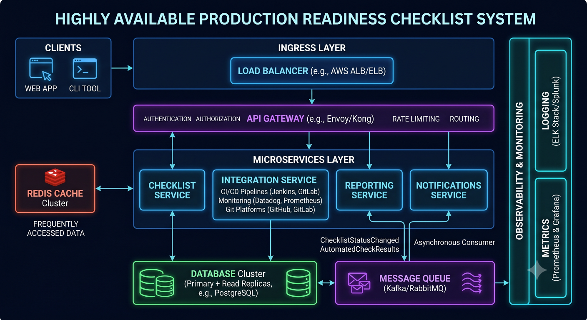

# Production Readiness Checklist

## Overview

This checklist ensures a system is safe to deploy into production with acceptable risk levels.

---

# Core Principle

A system is not production-ready if it is not **observable, recoverable, and scalable under failure**.

---

# 1. Functional Stability

- All core features implemented
- Edge cases handled
- Input validation present
- Idempotency ensured (where required)

---

# 2. Scalability Validation

- Can handle expected peak traffic
- Load testing completed
- Horizontal scaling supported
- Bottlenecks identified

---

# 3. Database Readiness

- Proper indexing in place
- Query performance tested
- Migration strategy defined
- Backup strategy enabled

---

# 4. Caching Layer

- Redis / cache layer implemented
- Cache invalidation strategy defined
- Cache hit ratio validated

---

# 5. Failure Handling

- Retry mechanisms implemented
- Circuit breakers configured
- Graceful degradation supported
- Fallback responses defined

---

# 6. Observability

- Logging enabled
- Metrics exposed
- Distributed tracing (if needed)
- Dashboards created

---

# 7. Deployment Safety

- CI/CD pipeline working
- Rollback strategy defined
- Blue/green or canary deployment enabled
- Feature flags available

---

# 8. Security

- Authentication implemented
- Authorization enforced
- Sensitive data encrypted
- API rate limiting applied

---

# 9. Real-Time Systems (if applicable)

- WebSocket scaling tested
- Connection limits defined
- Pub/Sub reliability verified

---

# Engineering Outcome

A system is production-ready only when it can survive real-world failure conditions while maintaining acceptable service levels.