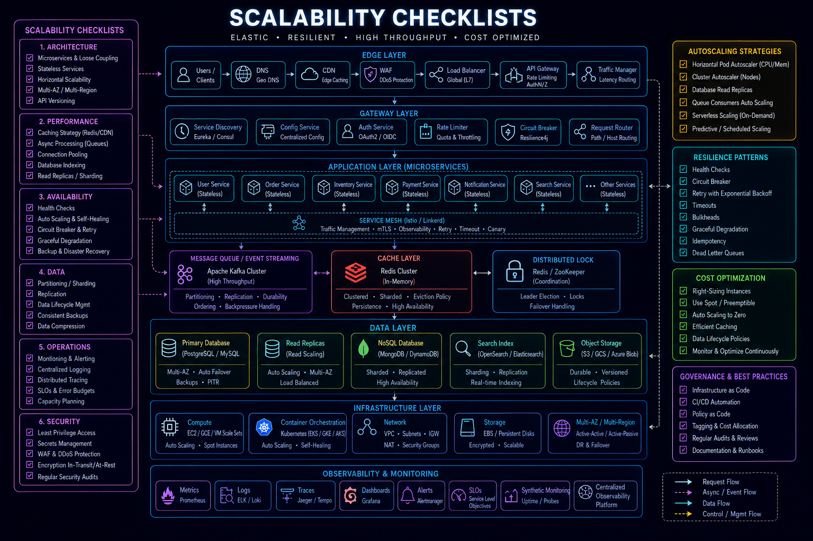

# Scalability Checklists

## Overview

This checklist helps evaluate whether a system can scale under increasing load.

---

# Core Principle

Scaling is not about handling current load — it is about handling **future unpredictable load**.

---

# 1. Traffic Analysis

- Expected QPS defined
- Peak traffic estimated
- Read vs write ratio known
- Burst traffic handled

---

# 2. Application Scaling

- Stateless services
- Horizontal scaling supported
- Load balancer configured
- Auto-scaling enabled

---

# 3. Database Scaling

- Read replicas used
- Sharding strategy defined
- Indexing optimized
- Query bottlenecks removed

---

# 4. Caching Strategy

- Redis / caching layer used
- Hot data identified
- Cache invalidation defined
- Cache penetration handled

---

# 5. Queue-Based Scaling

- Async processing enabled
- Queue backlog monitored
- Consumer scaling supported
- Retry mechanism in place

---

# 6. Real-Time Scaling

- WebSocket scaling tested
- Pub/Sub system configured
- Connection pooling handled
- Fan-out strategy optimized

---

# 7. Media / Large Data Scaling

- CDN used
- Object storage integrated
- Chunked uploads supported
- Compression applied

---

# 8. Bottleneck Analysis

- DB bottlenecks identified
- CPU-heavy operations optimized
- Network latency reduced
- Memory usage controlled

---

# Engineering Outcome

A scalable system is one where adding load results in predictable degradation, not system failure.