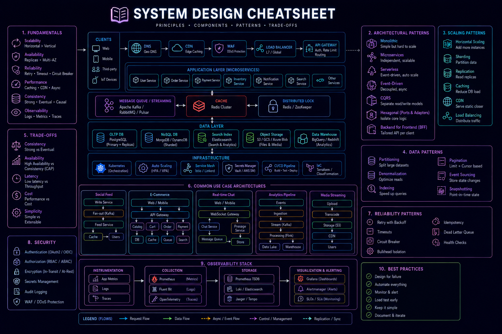

# System Design Cheat Sheet



## Overview

This cheat sheet is a **quick mental model framework** for solving system design problems in interviews and real systems.

---

# Step 1: Requirements

### Functional
- What system does?

### Non-functional
- Scale?
- Latency?
- Availability?

---

# Step 2: Estimate Scale

- Users
- QPS
- Storage
- Peak load

---

# Step 3: High-Level Architecture

```text
Client → Load Balancer → API → Services → DB